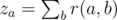

# E. Arkady and a Nobody-men

**time limit per test:** 2 seconds

**memory limit per test:** 256 megabytes

**input:** standard input

**output:** standard output

Arkady words in a large company. There are *n* employees working in a system of a strict hierarchy. Namely, each employee, with an exception of the CEO, has exactly one immediate manager. The CEO is a manager (through a chain of immediate managers) of all employees.

Each employee has an integer rank. The CEO has rank equal to 1, each other employee has rank equal to the rank of his immediate manager plus 1.

Arkady has a good post in the company, however, he feels that he is nobody in the company's structure, and there are a lot of people who can replace him. He introduced the value of replaceability. Consider an employee *a* and an employee *b*, the latter being manager of *a* (not necessarily immediate). Then the replaceability *r*(*a*, *b*) of *a* with respect to *b* is the number of subordinates (not necessarily immediate) of the manager *b*, whose rank is not greater than the rank of *a*. Apart from replaceability, Arkady introduced the value of negligibility. The negligibility *z*~*a*~ of employee *a* equals the sum of his replaceabilities with respect to all his managers, i.e.



, where the sum is taken over all his managers *b*.

Arkady is interested not only in negligibility of himself, but also in negligibility of all employees in the company. Find the negligibility of each employee for Arkady.

#### Input

The first line contains single integer *n* (1 ≤ *n* ≤ 5·10^5^) — the number of employees in the company.

The second line contains *n* integers *p*~1~, *p*~2~, ..., *p*~*n*~ (0 ≤ *p*~*i*~ ≤ *n*), where *p*~*i*~ = 0 if the *i*-th employee is the CEO, otherwise *p*~*i*~ equals the id of the immediate manager of the employee with id *i*. The employees are numbered from 1 to *n*. It is guaranteed that there is exactly one 0 among these values, and also that the CEO is a manager (not necessarily immediate) for all the other employees.

#### Output

Print *n* integers — the negligibilities of all employees in the order of their ids: *z*~1~, *z*~2~, ..., *z*~*n*~.

#### Examples

#### Input
```
4
0 1 2 1
```

#### Output
```
0 2 4 2 
```

#### Input
```
5
2 3 4 5 0
```

#### Output
```
10 6 3 1 0 
```

#### Input
```
5
0 1 1 1 3
```

#### Output
```
0 3 3 3 5 
```

#### Note

Consider the first example:

- The CEO has no managers, thus *z*~1~ = 0.
- *r*(2, 1) = 2 (employees 2 and 4 suit the conditions, employee 3 has too large rank). Thus *z*~2~ = *r*(2, 1) = 2.
- Similarly, *z*~4~ = *r*(4, 1) = 2.
- *r*(3, 2) = 1 (employee 3 is a subordinate of 2 and has suitable rank). *r*(3, 1) = 3 (employees 2, 3, 4 suit the conditions). Thus *z*~3~ = *r*(3, 2) + *r*(3, 1) = 4.
