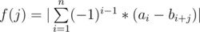

# E. Mahmoud and Ehab and the function

**time limit per test:** 2 seconds

**memory limit per test:** 256 megabytes

**input:** standard input

**output:** standard output

Dr. Evil is interested in math and functions, so he gave Mahmoud and Ehab array *a* of length *n* and array *b* of length *m*. He introduced a function *f*(*j*) which is defined for integers *j*, which satisfy 0 ≤ *j* ≤ *m* - *n*. Suppose, *c*~*i*~ = *a*~*i*~ - *b*~*i* + *j*~. Then *f*(*j*) = |*c*~1~ - *c*~2~ + *c*~3~ - *c*~4~... *c*~*n*~|. More formally,



.

Dr. Evil wants Mahmoud and Ehab to calculate the minimum value of this function over all valid *j*. They found it a bit easy, so Dr. Evil made their task harder. He will give them *q* update queries. During each update they should add an integer *x*~*i*~ to all elements in *a* in range [*l*~*i*~;*r*~*i*~] i.e. they should add *x*~*i*~ to *a*~*l*~*i*~~, *a*~*l*~*i*~ + 1~, ... , *a*~*r*~*i*~~ and then they should calculate the minimum value of *f*(*j*) for all valid *j*.

Please help Mahmoud and Ehab.

#### Input

The first line contains three integers *n*, *m* and *q* (1 ≤ *n* ≤ *m* ≤ 10^5^, 1 ≤ *q* ≤ 10^5^) — number of elements in *a*, number of elements in *b* and number of queries, respectively.

The second line contains *n* integers *a*~1~, *a*~2~, ..., *a*~*n*~. ( - 10^9^ ≤ *a*~*i*~ ≤ 10^9^) — elements of *a*.

The third line contains *m* integers *b*~1~, *b*~2~, ..., *b*~*m*~. ( - 10^9^ ≤ *b*~*i*~ ≤ 10^9^) — elements of *b*.

Then *q* lines follow describing the queries. Each of them contains three integers *l*~*i*~ *r*~*i*~ *x*~*i*~ (1 ≤ *l*~*i*~ ≤ *r*~*i*~ ≤ *n*,  - 10^9^ ≤ *x* ≤ 10^9^) — range to be updated and added value.

#### Output

The first line should contain the minimum value of the function *f* before any update.

Then output *q* lines, the *i*-th of them should contain the minimum value of the function *f* after performing the *i*-th update .

#### Example

#### Input
```
5 6 3
1 2 3 4 5
1 2 3 4 5 6
1 1 10
1 1 -9
1 5 -1
```

#### Output
```
0
9
0
0
```

#### Note

For the first example before any updates it's optimal to choose *j* = 0, *f*(0) = |(1 - 1) - (2 - 2) + (3 - 3) - (4 - 4) + (5 - 5)| = |0| = 0.

After the first update *a* becomes {11, 2, 3, 4, 5} and it's optimal to choose *j* = 1, *f*(1) = |(11 - 2) - (2 - 3) + (3 - 4) - (4 - 5) + (5 - 6) = |9| = 9.

After the second update *a* becomes {2, 2, 3, 4, 5} and it's optimal to choose *j* = 1, *f*(1) = |(2 - 2) - (2 - 3) + (3 - 4) - (4 - 5) + (5 - 6)| = |0| = 0.

After the third update *a* becomes {1, 1, 2, 3, 4} and it's optimal to choose *j* = 0, *f*(0) = |(1 - 1) - (1 - 2) + (2 - 3) - (3 - 4) + (4 - 5)| = |0| = 0.
