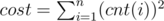

# F. Almost Permutation

**time limit per test:** 3 seconds

**memory limit per test:** 512 megabytes

**input:** standard input

**output:** standard output

Recently Ivan noticed an array *a* while debugging his code. Now Ivan can't remember this array, but the bug he was trying to fix didn't go away, so Ivan thinks that the data from this array might help him to reproduce the bug.

Ivan clearly remembers that there were *n* elements in the array, and each element was not less than 1 and not greater than *n*. Also he remembers *q* facts about the array. There are two types of facts that Ivan remembers:

- 1 *l*~*i*~ *r*~*i*~ *v*~*i*~ — for each *x* such that *l*~*i*~ ≤ *x* ≤ *r*~*i*~ *a*~*x*~ ≥ *v*~*i*~;
- 2 *l*~*i*~ *r*~*i*~ *v*~*i*~ — for each *x* such that *l*~*i*~ ≤ *x* ≤ *r*~*i*~ *a*~*x*~ ≤ *v*~*i*~.

Also Ivan thinks that this array was a permutation, but he is not so sure about it. He wants to restore some array that corresponds to the *q* facts that he remembers and is very similar to permutation. Formally, Ivan has denoted the *cost* of array as follows:



, where *cnt*(*i*) is the number of occurences of *i* in the array.

Help Ivan to determine minimum possible *cost* of the array that corresponds to the facts!

#### Input

The first line contains two integer numbers *n* and *q* (1 ≤ *n* ≤ 50, 0 ≤ *q* ≤ 100).

Then *q* lines follow, each representing a fact about the array. *i*-th line contains the numbers *t*~*i*~, *l*~*i*~, *r*~*i*~ and *v*~*i*~ for *i*-th fact (1 ≤ *t*~*i*~ ≤ 2, 1 ≤ *l*~*i*~ ≤ *r*~*i*~ ≤ *n*, 1 ≤ *v*~*i*~ ≤ *n*, *t*~*i*~ denotes the type of the fact).

#### Output

If the facts are controversial and there is no array that corresponds to them, print -1. Otherwise, print minimum possible *cost* of the array.

#### Examples

#### Input
```
3 0
```

#### Output
```
3
```

#### Input
```
3 1
1 1 3 2
```

#### Output
```
5
```

#### Input
```
3 2
1 1 3 2
2 1 3 2
```

#### Output
```
9
```

#### Input
```
3 2
1 1 3 2
2 1 3 1
```

#### Output
```
-1
```
