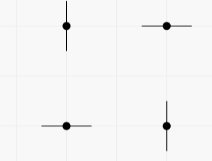
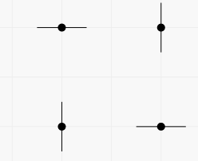

# E. Points, Lines and Ready-made Titles

**time limit per test:** 2 seconds

**memory limit per test:** 256 megabytes

**input:** standard input

**output:** standard output

You are given *n* distinct points on a plane with integral coordinates. For each point you can either draw a vertical line through it, draw a horizontal line through it, or do nothing.

You consider several coinciding straight lines as a single one. How many distinct pictures you can get? Print the answer modulo 10^9^ + 7.

#### Input

The first line contains single integer *n* (1 ≤ *n* ≤ 10^5^) — the number of points.

*n* lines follow. The (*i* + 1)-th of these lines contains two integers *x*~*i*~, *y*~*i*~ ( - 10^9^ ≤ *x*~*i*~, *y*~*i*~ ≤ 10^9^) — coordinates of the *i*-th point.

It is guaranteed that all points are distinct.

#### Output

Print the number of possible distinct pictures modulo 10^9^ + 7.

#### Examples

#### Input
```
4
1 1
1 2
2 1
2 2
```

#### Output
```
16
```

#### Input
```
2
-1 -1
0 1
```

#### Output
```
9
```

#### Note

In the first example there are two vertical and two horizontal lines passing through the points. You can get pictures with any subset of these lines. For example, you can get the picture containing all four lines in two ways (each segment represents a line containing it).
 The first way:



 The second way:




In the second example you can work with two points independently. The number of pictures is 3^2^ = 9.
