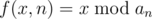
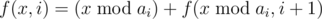
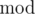

# E. Mod Mod Mod

**time limit per test:** 2 seconds

**memory limit per test:** 256 megabytes

**input:** standard input

**output:** standard output

You are given a sequence of integers *a*~1~, *a*~2~, ..., *a*~*n*~. Let



, and



 for 1 ≤ *i* < *n*. Here,



 denotes the modulus operation. Find the maximum value of *f*(*x*, 1) over all nonnegative integers *x*.

#### Input

The first line contains a single integer *n* (1 ≤ *n* ≤ 200000) — the length of the sequence.

The second lines contains *n* integers *a*~1~, *a*~2~, ..., *a*~*n*~ (1 ≤ *a*~*i*~ ≤ 10^13^) — the elements of the sequence.

#### Output

Output a single integer — the maximum value of *f*(*x*, 1) over all nonnegative integers *x*.

#### Examples

#### Input
```
2
10 5
```

#### Output
```
13
```

#### Input
```
5
5 4 3 2 1
```

#### Output
```
6
```

#### Input
```
4
5 10 5 10
```

#### Output
```
16
```

#### Note

In the first example you can choose, for example, *x* = 19.

In the second example you can choose, for example, *x* = 3 or *x* = 2.
