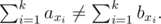

# B. Gluttony

**time limit per test:** 2 seconds

**memory limit per test:** 256 megabytes

**input:** standard input

**output:** standard output

You are given an array *a* with *n* distinct integers. Construct an array *b* by permuting *a* such that for every non-empty subset of indices *S* = {*x*~1~, *x*~2~, ..., *x*~*k*~} (1 ≤ *x*~*i*~ ≤ *n*, 0 < *k* < *n*) the sums of elements on that positions in *a* and *b* are different, i. e.



#### Input

The first line contains one integer *n* (1 ≤ *n* ≤ 22) — the size of the array.

The second line contains *n* space-separated distinct integers *a*~1~, *a*~2~, ..., *a*~*n*~ (0 ≤ *a*~*i*~ ≤ 10^9^) — the elements of the array.

#### Output

If there is no such array *b*, print -1.

Otherwise in the only line print *n* space-separated integers *b*~1~, *b*~2~, ..., *b*~*n*~. Note that *b* must be a permutation of *a*.

If there are multiple answers, print any of them.

#### Examples

#### Input
```
2
1 2
```

#### Output
```
2 1 
```

#### Input
```
4
1000 100 10 1
```

#### Output
```
100 1 1000 10
```

#### Note

An array *x* is a permutation of *y*, if we can shuffle elements of *y* such that it will coincide with *x*.

Note that the empty subset and the subset containing all indices are not counted.
