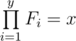

# E. Counting Arrays

**time limit per test:** 3 seconds

**memory limit per test:** 256 megabytes

**input:** standard input

**output:** standard output

You are given two positive integer numbers *x* and *y*. An array *F* is called an *y*-factorization of *x* iff the following conditions are met:

- There are *y* elements in *F*, and all of them are integer numbers;
-



.

You have to count the number of pairwise distinct arrays that are *y*-factorizations of *x*. Two arrays *A* and *B* are considered different iff there exists at least one index *i* (1 ≤ *i* ≤ *y*) such that *A*~*i*~ ≠ *B*~*i*~. Since the answer can be very large, print it modulo 10^9^ + 7.

#### Input

The first line contains one integer *q* (1 ≤ *q* ≤ 10^5^) — the number of testcases to solve.

Then *q* lines follow, each containing two integers *x*~*i*~ and *y*~*i*~ (1 ≤ *x*~*i*~, *y*~*i*~ ≤ 10^6^). Each of these lines represents a testcase.

#### Output

Print *q* integers. *i*-th integer has to be equal to the number of *y*~*i*~-factorizations of *x*~*i*~ modulo 10^9^ + 7.

#### Example

#### Input
```
2
6 3
4 2
```

#### Output
```
36
6
```

#### Note

In the second testcase of the example there are six *y*-factorizations:

- { - 4,  - 1};
- { - 2,  - 2};
- { - 1,  - 4};
- {1, 4};
- {2, 2};
- {4, 1}.
