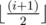

# D. Ralph And His Tour in Binary Country

**time limit per test:** 2.5 seconds

**memory limit per test:** 512 megabytes

**input:** standard input

**output:** standard output

Ralph is in the Binary Country. The Binary Country consists of *n* cities and (*n* - 1) bidirectional roads connecting the cities. The roads are numbered from 1 to (*n* - 1), the *i*-th road connects the city labeled



 (here ⌊ *x*⌋ denotes the *x* rounded down to the nearest integer) and the city labeled (*i* + 1), and the length of the *i*-th road is *L*~*i*~.

Now Ralph gives you *m* queries. In each query he tells you some city *A*~*i*~ and an integer *H*~*i*~. He wants to make some tours starting from this city. He can choose any city in the Binary Country (including *A*~*i*~) as the terminal city for a tour. He gains happiness (*H*~*i*~ - *L*) during a tour, where *L* is the distance between the city *A*~*i*~ and the terminal city.

Ralph is interested in tours from *A*~*i*~ in which he can gain positive happiness. For each query, compute the sum of happiness gains for all such tours.

Ralph will never take the same tour twice or more (in one query), he will never pass the same city twice or more in one tour.

#### Input

The first line contains two integers *n* and *m* (1 ≤ *n* ≤ 10^6^, 1 ≤ *m* ≤ 10^5^).

(*n* - 1) lines follow, each line contains one integer *L*~*i*~ (1 ≤ *L*~*i*~ ≤ 10^5^), which denotes the length of the *i*-th road.

*m* lines follow, each line contains two integers *A*~*i*~ and *H*~*i*~ (1 ≤ *A*~*i*~ ≤ *n*, 0 ≤ *H*~*i*~ ≤ 10^7^).

#### Output

Print *m* lines, on the *i*-th line print one integer — the answer for the *i*-th query.

#### Examples

#### Input
```
2 2
5
1 8
2 4
```

#### Output
```
11
4
```

#### Input
```
6 4
2
1
1
3
2
2 4
1 3
3 2
1 7
```

#### Output
```
11
6
3
28
```

#### Note

Here is the explanation for the second sample.

Ralph's first query is to start tours from city 2 and *H*~*i*~ equals to 4. Here are the options:

- He can choose city 5 as his terminal city. Since the distance between city 5 and city 2 is 3, he can gain happiness 4 - 3 = 1.
- He can choose city 4 as his terminal city and gain happiness 3.
- He can choose city 1 as his terminal city and gain happiness 2.
- He can choose city 3 as his terminal city and gain happiness 1.
- Note that Ralph can choose city 2 as his terminal city and gain happiness 4.
- Ralph won't choose city 6 as his terminal city because the distance between city 6 and city 2 is 5, which leads to negative happiness for Ralph.

So the answer for the first query is 1 + 3 + 2 + 1 + 4 = 11.
