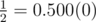
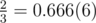

# B. Position in Fraction

**time limit per test:** 1 second

**memory limit per test:** 256 megabytes

**input:** standard input

**output:** standard output

You have a fraction


. You need to find the first occurrence of digit *c* into decimal notation of the fraction after decimal point.

#### Input

The first contains three single positive integers *a*, *b*, *c* (1 ≤ *a* < *b* ≤ 10^5^, 0 ≤ *c* ≤ 9).

#### Output

Print position of the first occurrence of digit *c* into the fraction. Positions are numbered from 1 after decimal point. It there is no such position, print -1.

#### Examples

#### Input
```
1 2 0
```

#### Output
```
2
```

#### Input
```
2 3 7
```

#### Output
```
-1
```

#### Note

The fraction in the first example has the following decimal notation:



. The first zero stands on second position.

The fraction in the second example has the following decimal notation:



. There is no digit 7 in decimal notation of the fraction.
