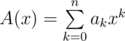
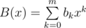
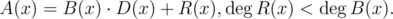
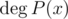
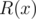
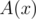
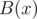

# B. GCD of Polynomials

**time limit per test:** 2 seconds

**memory limit per test:** 256 megabytes

**input:** standard input

**output:** standard output

Suppose you have two polynomials



 and



. Then polynomial


 can be uniquely represented in the following way:



This can be done using [long division](<https://en.wikipedia.org/wiki/Polynomial_long_division>). Here,



 denotes the degree of polynomial *P*(*x*).



 is called the remainder of division of polynomial



 by polynomial



, it is also denoted as


.

Since there is a way to divide polynomials with remainder, we can define Euclid's algorithm of finding the greatest common divisor of two polynomials. The algorithm takes two polynomials


. If the polynomial


 is zero, the result is


, otherwise the result is the value the algorithm returns for pair


. On each step the degree of the second argument decreases, so the algorithm works in finite number of steps. But how large that number could be? You are to answer this question.

You are given an integer *n*. You have to build two polynomials with degrees not greater than *n*, such that their coefficients are integers not exceeding 1 by their absolute value, the leading coefficients (ones with the greatest power of *x*) are equal to one, and the described Euclid's algorithm performs exactly *n* steps finding their greatest common divisor. Moreover, the degree of the first polynomial should be greater than the degree of the second. By a step of the algorithm we mean the transition from pair


 to pair


.

#### Input

You are given a single integer *n* (1 ≤ *n* ≤ 150) — the number of steps of the algorithm you need to reach.

#### Output

Print two polynomials in the following format.

In the first line print a single integer *m* (0 ≤ *m* ≤ *n*) — the degree of the polynomial.

In the second line print *m* + 1 integers between  - 1 and 1 — the coefficients of the polynomial, from constant to leading.

The degree of the first polynomial should be greater than the degree of the second polynomial, the leading coefficients should be equal to 1. Euclid's algorithm should perform exactly *n* steps when called using these polynomials.

If there is no answer for the given *n*, print -1.

If there are multiple answer, print any of them.

#### Examples

#### Input
```
1
```

#### Output
```
1
0 1
0
1
```

#### Input
```
2
```

#### Output
```
2
-1 0 1
1
0 1
```

#### Note

In the second example you can print polynomials *x*^2^ - 1 and *x*. The sequence of transitions is
(*x*^2^ - 1, *x*) → (*x*,  - 1) → ( - 1, 0).
There are two steps in it.
