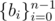
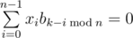
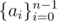
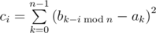
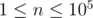
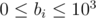
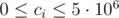

# E. Cyclic Cipher

**time limit per test:** 5 seconds

**memory limit per test:** 256 megabytes

**input:** standard input

**output:** standard output


Senor Vorpal Kickass'o invented an innovative method to encrypt integer sequences of length *n*. To encrypt a sequence, one has to choose a secret sequence



, that acts as a key.

Vorpal is very selective, so the key should be such a sequence *b*~*i*~, that its cyclic shifts are linearly independent, that is, there is no non-zero set of coefficients *x*~0~, *x*~1~, ..., *x*~*n* - 1~, such that



 for all *k* at the same time.

After that for a sequence



 you should build the following cipher:



In other words, you are to compute the quadratic deviation between each cyclic shift of *b*~*i*~ and the sequence *a*~*i*~. The resulting sequence is the Kickass's cipher. The cipher is in development right now and Vorpal wants to decipher a sequence after it has been encrypted. You are to solve this problem for him. You are given sequences *c*~*i*~ and *b*~*i*~. You are to find all suitable sequences *a*~*i*~.

#### Input

The first line contains a single integer *n* (



).

The second line contains *n* integers *b*~0~, *b*~1~, ..., *b*~*n* - 1~ (



).

The third line contains *n* integers *c*~0~, *c*~1~, ..., *c*~*n* - 1~ (



).

It is guaranteed that all cyclic shifts of sequence *b*~*i*~ are linearly independent.

#### Output

In the first line print a single integer *k* — the number of sequences *a*~*i*~, such that after encrypting them with key *b*~*i*~ you get the sequence *c*~*i*~.

After that in each of *k* next lines print *n* integers *a*~0~, *a*~1~, ..., *a*~*n* - 1~. Print the sequences in lexicographical order.

Note that *k* could be equal to 0.

#### Examples

#### Input
```
1
1
0
```

#### Output
```
1
1
```

#### Input
```
1
100
81
```

#### Output
```
2
91
109
```

#### Input
```
3
1 1 3
165 185 197
```

#### Output
```
2
-6 -9 -1
8 5 13
```
