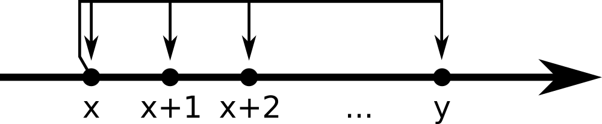
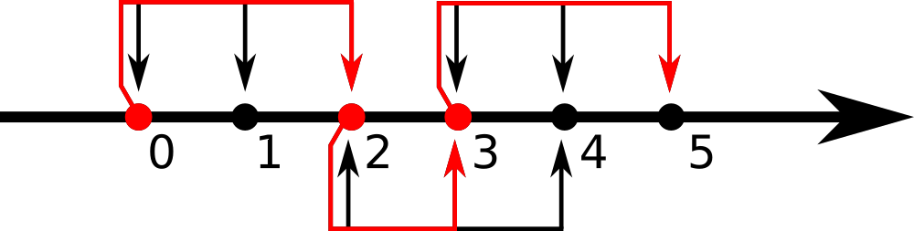
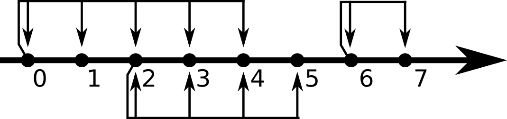

# A. Visiting a Friend

**time limit per test:** 1 second

**memory limit per test:** 256 megabytes

**input:** standard input

**output:** standard output

Pig is visiting a friend.

Pig's house is located at point 0, and his friend's house is located at point *m* on an axis.

Pig can use teleports to move along the axis.

To use a teleport, Pig should come to a certain point (where the teleport is located) and choose where to move: for each teleport there is the rightmost point it can move Pig to, this point is known as the limit of the teleport.

Formally, a teleport located at point *x* with limit *y* can move Pig from point *x* to any point within the segment [*x*; *y*], including the bounds.





Determine if Pig can visit the friend using teleports only, or he should use his car.

#### Input

The first line contains two integers *n* and *m* (1 ≤ *n* ≤ 100, 1 ≤ *m* ≤ 100) — the number of teleports and the location of the friend's house.

The next *n* lines contain information about teleports.

The *i*-th of these lines contains two integers *a*~*i*~ and *b*~*i*~ (0 ≤ *a*~*i*~ ≤ *b*~*i*~ ≤ *m*), where *a*~*i*~ is the location of the *i*-th teleport, and *b*~*i*~ is its limit.

It is guaranteed that *a*~*i*~ ≥ *a*~*i* - 1~ for every *i* (2 ≤ *i* ≤ *n*).

#### Output

Print "YES" if there is a path from Pig's house to his friend's house that uses only teleports, and "NO" otherwise.

You can print each letter in arbitrary case (upper or lower).

#### Examples

#### Input
```
3 5
0 2
2 4
3 5
```

#### Output
```
YES
```

#### Input
```
3 7
0 4
2 5
6 7
```

#### Output
```
NO
```

#### Note

The first example is shown on the picture below:





Pig can use the first teleport from his house (point 0) to reach point 2, then using the second teleport go from point 2 to point 3, then using the third teleport go from point 3 to point 5, where his friend lives.

The second example is shown on the picture below:





You can see that there is no path from Pig's house to his friend's house that uses only teleports.
