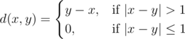

# D. Almost Difference

**time limit per test:** 2 seconds

**memory limit per test:** 256 megabytes

**input:** standard input

**output:** standard output

Let's denote a function



You are given an array *a* consisting of *n* integers. You have to calculate the sum of *d*(*a*~*i*~, *a*~*j*~) over all pairs (*i*, *j*) such that 1 ≤ *i* ≤ *j* ≤ *n*.

#### Input

The first line contains one integer *n* (1 ≤ *n* ≤ 200000) — the number of elements in *a*.

The second line contains *n* integers *a*~1~, *a*~2~, ..., *a*~*n*~ (1 ≤ *a*~*i*~ ≤ 10^9^) — elements of the array.

#### Output

Print one integer — the sum of *d*(*a*~*i*~, *a*~*j*~) over all pairs (*i*, *j*) such that 1 ≤ *i* ≤ *j* ≤ *n*.

#### Examples

#### Input
```
5
1 2 3 1 3
```

#### Output
```
4
```

#### Input
```
4
6 6 5 5
```

#### Output
```
0
```

#### Input
```
4
6 6 4 4
```

#### Output
```
-8
```

#### Note

In the first example:

- *d*(*a*~1~, *a*~2~) = 0;
- *d*(*a*~1~, *a*~3~) = 2;
- *d*(*a*~1~, *a*~4~) = 0;
- *d*(*a*~1~, *a*~5~) = 2;
- *d*(*a*~2~, *a*~3~) = 0;
- *d*(*a*~2~, *a*~4~) = 0;
- *d*(*a*~2~, *a*~5~) = 0;
- *d*(*a*~3~, *a*~4~) =  - 2;
- *d*(*a*~3~, *a*~5~) = 0;
- *d*(*a*~4~, *a*~5~) = 2.
