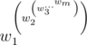

# D. Power Tower

**time limit per test:** 4.5 seconds

**memory limit per test:** 256 megabytes

**input:** standard input

**output:** standard output

Priests of the Quetzalcoatl cult want to build a tower to represent a power of their god. Tower is usually made of power-charged rocks. It is built with the help of rare magic by levitating the current top of tower and adding rocks at its bottom. If top, which is built from *k* - 1 rocks, possesses power *p* and we want to add the rock charged with power *w*~*k*~ then value of power of a new tower will be {*w*~*k*~}^*p*^.

Rocks are added from the last to the first. That is for sequence *w*~1~, ..., *w*~*m*~ value of power will be



After tower is built, its power may be extremely large. But still priests want to get some information about it, namely they want to know a number called cumulative power which is the true value of power taken modulo *m*. Priests have *n* rocks numbered from 1 to *n*. They ask you to calculate which value of cumulative power will the tower possess if they will build it from rocks numbered *l*, *l* + 1, ..., *r*.

#### Input

First line of input contains two integers *n* (1 ≤ *n* ≤ 10^5^) and *m* (1 ≤ *m* ≤ 10^9^).

Second line of input contains *n* integers *w*~*k*~ (1 ≤ *w*~*k*~ ≤ 10^9^) which is the power of rocks that priests have.

Third line of input contains single integer *q* (1 ≤ *q* ≤ 10^5^) which is amount of queries from priests to you.

*k*^*th*^ of next *q* lines contains two integers *l*~*k*~ and *r*~*k*~ (1 ≤ *l*~*k*~ ≤ *r*~*k*~ ≤ *n*).

#### Output

Output *q* integers. *k*-th of them must be the amount of cumulative power the tower will have if is built from rocks *l*~*k*~, *l*~*k*~ + 1, ..., *r*~*k*~.

#### Example

#### Input
```
6 1000000000
1 2 2 3 3 3
8
1 1
1 6
2 2
2 3
2 4
4 4
4 5
4 6
```

#### Output
```
1
1
2
4
256
3
27
597484987
```

#### Note

3^27^ = 7625597484987
