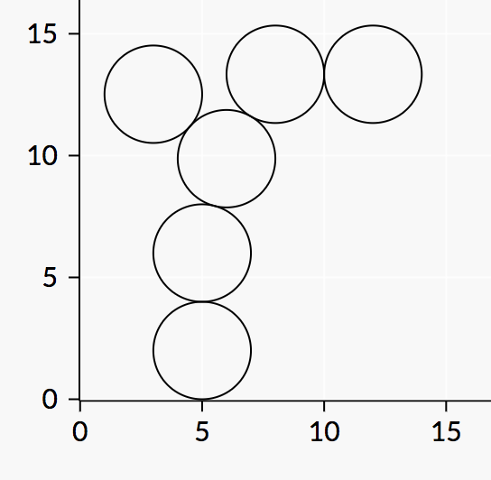

# C. New Year and Curling

**time limit per test:** 2 seconds

**memory limit per test:** 256 megabytes

**input:** standard input

**output:** standard output

Carol is currently curling.

She has *n* disks each with radius *r* on the 2D plane.

Initially she has all these disks above the line *y* = 10^100^.

She then will slide the disks towards the line *y* = 0 one by one in order from 1 to *n*.

When she slides the *i*-th disk, she will place its center at the point (*x*~*i*~, 10^100^). She will then push it so the disk’s *y* coordinate continuously decreases, and *x* coordinate stays constant. The disk stops once it touches the line *y* = 0 or it touches any previous disk. Note that once a disk stops moving, it will not move again, even if hit by another disk.

Compute the *y*-coordinates of centers of all the disks after all disks have been pushed.

#### Input

The first line will contain two integers *n* and *r* (1 ≤ *n*, *r* ≤ 1 000), the number of disks, and the radius of the disks, respectively.

The next line will contain *n* integers *x*~1~, *x*~2~, ..., *x*~*n*~ (1 ≤ *x*~*i*~ ≤ 1 000) — the *x*-coordinates of the disks.

#### Output

Print a single line with *n* numbers. The *i*-th number denotes the *y*-coordinate of the center of the *i*-th disk. The output will be accepted if it has absolute or relative error at most 10^ - 6^.

Namely, let's assume that your answer for a particular value of a coordinate is *a* and the answer of the jury is *b*. The checker program will consider your answer correct if


 for all coordinates.

#### Example

#### Input
```
6 2
5 5 6 8 3 12
```

#### Output
```
2 6.0 9.87298334621 13.3370849613 12.5187346573 13.3370849613
```

#### Note

The final positions of the disks will look as follows:





In particular, note the position of the last disk.
