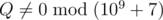
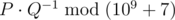
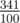

# D. New Year and Arbitrary Arrangement

**time limit per test:** 2 seconds

**memory limit per test:** 256 megabytes

**input:** standard input

**output:** standard output

You are given three integers *k*, *p*~*a*~ and *p*~*b*~.

You will construct a sequence with the following algorithm: Initially, start with the empty sequence. Each second, you do the following. With probability *p*~*a*~ / (*p*~*a*~ + *p*~*b*~), add 'a' to the end of the sequence. Otherwise (with probability *p*~*b*~ / (*p*~*a*~ + *p*~*b*~)), add 'b' to the end of the sequence.

You stop once there are at least *k* subsequences that form 'ab'. Determine the expected number of times 'ab' is a subsequence in the resulting sequence. It can be shown that this can be represented by *P* / *Q*, where *P* and *Q* are coprime integers, and



. Print the value of



.

#### Input

The first line will contain three integers integer *k*, *p*~*a*~, *p*~*b*~ (1 ≤ *k* ≤ 1 000, 1 ≤ *p*~*a*~, *p*~*b*~ ≤ 1 000 000).

#### Output

Print a single integer, the answer to the problem.

#### Examples

#### Input
```
1 1 1
```

#### Output
```
2
```

#### Input
```
3 1 4
```

#### Output
```
370000006
```

#### Note

The first sample, we will keep appending to our sequence until we get the subsequence 'ab' at least once. For instance, we get the sequence 'ab' with probability 1/4, 'bbab' with probability 1/16, and 'aab' with probability 1/8. Note, it's impossible for us to end with a sequence like 'aabab', since we would have stopped our algorithm once we had the prefix 'aab'.

The expected amount of times that 'ab' will occur across all valid sequences is 2.

For the second sample, the answer is equal to



.
