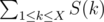

# G. New Year and Original Order

**time limit per test:** 2 seconds

**memory limit per test:** 256 megabytes

**input:** standard input

**output:** standard output

Let *S*(*n*) denote the number that represents the digits of *n* in sorted order. For example, *S*(1) = 1, *S*(5) = 5, *S*(50394) = 3459, *S*(353535) = 333555.

Given a number *X*, compute



 modulo 10^9^ + 7.

#### Input

The first line of input will contain the integer *X* (1 ≤ *X* ≤ 10^700^).

#### Output

Print a single integer, the answer to the question.

#### Examples

#### Input
```
21
```

#### Output
```
195
```

#### Input
```
345342
```

#### Output
```
390548434
```

#### Note

The first few values of *S* are 1, 2, 3, 4, 5, 6, 7, 8, 9, 1, 11, 12, 13, 14, 15, 16, 17, 18, 19, 2, 12. The sum of these values is 195.
