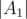
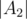
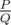
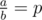
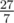
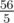

# F. Strongly Connected Tournament

**time limit per test:** 2 seconds

**memory limit per test:** 256 megabytes

**input:** standard input

**output:** standard output

There is a chess tournament in All-Right-City. *n* players were invited to take part in the competition. The tournament is held by the following rules:

- Initially, each player plays one game with every other player. There are no ties;
- After that, the organizers build a complete directed graph with players as vertices. For every pair of players there is exactly one directed edge between them: the winner of their game is the startpoint of this edge and the loser is the endpoint;
- After that, the organizers build a condensation of this graph. The condensation of this graph is an acyclic complete graph, therefore it has the only Hamiltonian path which consists of strongly connected components of initial graph *A*~1~ → *A*~2~ → ... → *A*~*k*~.
- The players from the first component *A*~1~ are placed on the first



 places, the players from the component *A*~2~ are placed on the next



 places, and so on.
- To determine exact place of each player in a strongly connected component, all the procedures from 1 to 5 are repeated recursively inside each component, i.e. for every *i* = 1, 2, ..., *k* players from the component *A*~*i*~ play games with each other again, and so on;
- If a component consists of a single player, then he has no more rivals, his place is already determined and the process stops.

The players are enumerated with integers from 1 to *n*. The enumeration was made using results of a previous tournament. It is known that player *i* wins player *j* (*i* < *j*) with probability *p*.

You need to help to organize the tournament. Find the expected value of total number of games played by all the players.

It can be shown that the answer can be represented as



, where *P* and *Q* are coprime integers and


. Print the value of *P*·*Q*^ - 1^ modulo 998244353.

If you are not familiar with any of the terms above, you can read about them [here](<https://en.wikipedia.org/wiki/Strongly_connected_component>).

#### Input

The first line of input contains a single integer *n* (2 ≤ *n* ≤ 2000) — the number of players.

The second line contains two integers *a* and *b* (1 ≤ *a* < *b* ≤ 100) — the numerator and the denominator of fraction



.

#### Output

In the only line print the expected value of total number of games played by all the players. Print the answer using the format above.

#### Examples

#### Input
```
3
1 2
```

#### Output
```
4
```

#### Input
```
3
4 6
```

#### Output
```
142606340
```

#### Input
```
4
1 2
```

#### Output
```
598946623
```

#### Note

In the first example the expected value is 4.

In the second example the expected value is



.

In the third example the expected value is



.
