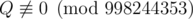

# H. Don't Exceed

**time limit per test:** 4 seconds

**memory limit per test:** 256 megabytes

**input:** standard input

**output:** standard output

You generate real numbers *s*~1~, *s*~2~, ..., *s*~*n*~ as follows:

- *s*~0~ = 0;
- *s*~*i*~ = *s*~*i* - 1~ + *t*~*i*~, where *t*~*i*~ is a real number chosen independently uniformly at random between 0 and 1, inclusive.

You are given real numbers *x*~1~, *x*~2~, ..., *x*~*n*~. You are interested in the probability that *s*~*i*~ ≤ *x*~*i*~ is true for all *i* simultaneously.

It can be shown that this can be represented as


, where *P* and *Q* are coprime integers, and



. Print the value of *P*·*Q*^ - 1^ modulo 998244353.

#### Input

The first line contains integer *n* (1 ≤ *n* ≤ 30).

The next *n* lines contain real numbers *x*~1~, *x*~2~, ..., *x*~*n*~, given with at most six digits after the decimal point (0 < *x*~*i*~ ≤ *n*).

#### Output

Print a single integer, the answer to the problem.

#### Examples

#### Input
```
4
1.00
2
3.000000
4.0
```

#### Output
```
1
```

#### Input
```
1
0.50216
```

#### Output
```
342677322
```

#### Input
```
2
0.5
1.0
```

#### Output
```
623902721
```

#### Input
```
6
0.77
1.234567
2.1
1.890
2.9999
3.77
```

#### Output
```
859831967
```

#### Note

In the first example, the sought probability is 1 since the sum of *i* real numbers which don't exceed 1 doesn't exceed *i*.

In the second example, the probability is *x*~1~ itself.

In the third example, the sought probability is 3 / 8.
