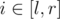
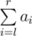

# F. SUM and REPLACE

**time limit per test:** 2 seconds

**memory limit per test:** 256 megabytes

**input:** standard input

**output:** standard output

Let *D*(*x*) be the number of positive divisors of a positive integer *x*. For example, *D*(2) = 2 (2 is divisible by 1 and 2), *D*(6) = 4 (6 is divisible by 1, 2, 3 and 6).

You are given an array *a* of *n* integers. You have to process two types of queries:

- REPLACE *l* *r* — for every



 replace *a*~*i*~ with *D*(*a*~*i*~);
- SUM *l* *r* — calculate



.

Print the answer for each SUM query.

#### Input

The first line contains two integers *n* and *m* (1 ≤ *n*, *m* ≤ 3·10^5^) — the number of elements in the array and the number of queries to process, respectively.

The second line contains *n* integers *a*~1~, *a*~2~, ..., *a*~*n*~ (1 ≤ *a*~*i*~ ≤ 10^6^) — the elements of the array.

Then *m* lines follow, each containing 3 integers *t*~*i*~, *l*~*i*~, *r*~*i*~ denoting *i*-th query. If *t*~*i*~ = 1, then *i*-th query is REPLACE *l*~*i*~ *r*~*i*~, otherwise it's SUM *l*~*i*~ *r*~*i*~ (1 ≤ *t*~*i*~ ≤ 2, 1 ≤ *l*~*i*~ ≤ *r*~*i*~ ≤ *n*).

There is at least one SUM query.

#### Output

For each SUM query print the answer to it.

#### Example

#### Input
```
7 6
6 4 1 10 3 2 4
2 1 7
2 4 5
1 3 5
2 4 4
1 5 7
2 1 7
```

#### Output
```
30
13
4
22
```
