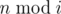
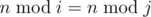
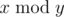

# C. Cave Painting

**time limit per test:** 1 second

**memory limit per test:** 256 megabytes

**input:** standard input

**output:** standard output

Imp is watching a documentary about cave painting.


Some numbers, carved in chaotic order, immediately attracted his attention. Imp rapidly proposed a guess that they are the remainders of division of a number *n* by all integers *i* from 1 to *k*. Unfortunately, there are too many integers to analyze for Imp.

Imp wants you to check whether all these remainders are distinct. Formally, he wants to check, if all



, 1 ≤ *i* ≤ *k*, are distinct, i. e. there is no such pair (*i*, *j*) that:

- 1 ≤ *i* < *j* ≤ *k*,
-



, where



 is the remainder of division *x* by *y*.

#### Input

The only line contains two integers *n*, *k* (1 ≤ *n*, *k* ≤ 10^18^).

#### Output

Print "Yes", if all the remainders are distinct, and "No" otherwise.

You can print each letter in arbitrary case (lower or upper).

#### Examples

#### Input
```
4 4
```

#### Output
```
No
```

#### Input
```
5 3
```

#### Output
```
Yes
```

#### Note

In the first sample remainders modulo 1 and 4 coincide.
