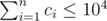

# E. Birds

**time limit per test:** 1 second

**memory limit per test:** 256 megabytes

**input:** standard input

**output:** standard output

Apart from plush toys, Imp is a huge fan of little yellow birds!


To summon birds, Imp needs strong magic. There are *n* trees in a row on an alley in a park, there is a nest on each of the trees. In the *i*-th nest there are *c*~*i*~ birds; to summon one bird from this nest Imp needs to stay under this tree and it costs him *cost*~*i*~ points of mana. However, for each bird summoned, Imp increases his mana capacity by *B* points. Imp summons birds one by one, he can summon any number from 0 to *c*~*i*~ birds from the *i*-th nest.

Initially Imp stands under the first tree and has *W* points of mana, and his mana capacity equals *W* as well. He can only go forward, and each time he moves from a tree to the next one, he restores *X* points of mana (but it can't exceed his current mana capacity). Moving only forward, what is the maximum number of birds Imp can summon?

#### Input

The first line contains four integers *n*, *W*, *B*, *X* (1 ≤ *n* ≤ 10^3^, 0 ≤ *W*, *B*, *X* ≤ 10^9^) — the number of trees, the initial points of mana, the number of points the mana capacity increases after a bird is summoned, and the number of points restored when Imp moves from a tree to the next one.

The second line contains *n* integers *c*~1~, *c*~2~, ..., *c*~*n*~ (0 ≤ *c*~*i*~ ≤ 10^4^) — where *c*~*i*~ is the number of birds living in the *i*-th nest. It is guaranteed that



.

The third line contains *n* integers *cost*~1~, *cost*~2~, ..., *cost*~*n*~ (0 ≤ *cost*~*i*~ ≤ 10^9^), where *cost*~*i*~ is the mana cost to summon a bird from the *i*-th nest.

#### Output

Print a single integer — the maximum number of birds Imp can summon.

#### Examples

#### Input
```
2 12 0 4
3 4
4 2
```

#### Output
```
6
```

#### Input
```
4 1000 10 35
1 2 4 5
1000 500 250 200
```

#### Output
```
5
```

#### Input
```
2 10 7 11
2 10
6 1
```

#### Output
```
11
```

#### Note

In the first sample base amount of Imp's mana is equal to 12 (with maximum capacity also equal to 12). After he summons two birds from the first nest, he loses 8 mana points, although his maximum capacity will not increase (since *B* = 0). After this step his mana will be 4 of 12; during the move you will replenish 4 mana points, and hence own 8 mana out of 12 possible. Now it's optimal to take 4 birds from the second nest and spend 8 mana. The final answer will be — 6.

In the second sample the base amount of mana is equal to 1000. The right choice will be to simply pick all birds from the last nest. Note that Imp's mana doesn't restore while moving because it's initially full.
