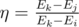
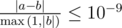
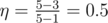
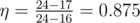

# B. Three-level Laser

**time limit per test:** 1 second

**memory limit per test:** 256 megabytes

**input:** standard input

**output:** standard output

An atom of element X can exist in *n* distinct states with energies *E*~1~ < *E*~2~ < ... < *E*~*n*~. Arkady wants to build a laser on this element, using a three-level scheme. Here is a simplified description of the scheme.

Three distinct states *i*, *j* and *k* are selected, where *i* < *j* < *k*. After that the following process happens:

- initially the atom is in the state *i*,
- we spend *E*~*k*~ - *E*~*i*~ energy to put the atom in the state *k*,
- the atom emits a photon with useful energy *E*~*k*~ - *E*~*j*~ and changes its state to the state *j*,
- the atom spontaneously changes its state to the state *i*, losing energy *E*~*j*~ - *E*~*i*~,
- the process repeats from step 1.

Let's define the energy conversion efficiency as



, i. e. the ration between the useful energy of the photon and spent energy.

Due to some limitations, Arkady can only choose such three states that *E*~*k*~ - *E*~*i*~ ≤ *U*.

Help Arkady to find such the maximum possible energy conversion efficiency within the above constraints.

#### Input

The first line contains two integers *n* and *U* (3 ≤ *n* ≤ 10^5^, 1 ≤ *U* ≤ 10^9^) — the number of states and the maximum possible difference between *E*~*k*~ and *E*~*i*~.

The second line contains a sequence of integers *E*~1~, *E*~2~, ..., *E*~*n*~ (1 ≤ *E*~1~ < *E*~2~... < *E*~*n*~ ≤ 10^9^). It is guaranteed that all *E*~*i*~ are given in increasing order.

#### Output

If it is not possible to choose three states that satisfy all constraints, print -1.

Otherwise, print one real number η — the maximum possible energy conversion efficiency. Your answer is considered correct its absolute or relative error does not exceed 10^ - 9^.

Formally, let your answer be *a*, and the jury's answer be *b*. Your answer is considered correct if



.

#### Examples

#### Input
```
4 4
1 3 5 7
```

#### Output
```
0.5
```

#### Input
```
10 8
10 13 15 16 17 19 20 22 24 25
```

#### Output
```
0.875
```

#### Input
```
3 1
2 5 10
```

#### Output
```
-1
```

#### Note

In the first example choose states 1, 2 and 3, so that the energy conversion efficiency becomes equal to



.

In the second example choose states 4, 5 and 9, so that the energy conversion efficiency becomes equal to



.
