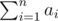

# E. Wardrobe

**time limit per test:** 1 second

**memory limit per test:** 256 megabytes

**input:** standard input

**output:** standard output

Olya wants to buy a custom wardrobe. It should have *n* boxes with heights *a*~1~, *a*~2~, ..., *a*~*n*~, stacked one on another in some order. In other words, we can represent each box as a vertical segment of length *a*~*i*~, and all these segments should form a single segment from 0 to



 without any overlaps.

Some of the boxes are important (in this case *b*~*i*~ = 1), others are not (then *b*~*i*~ = 0). Olya defines the convenience of the wardrobe as the number of important boxes such that their bottom edge is located between the heights *l* and *r*, inclusive.

You are given information about heights of the boxes and their importance. Compute the maximum possible convenience of the wardrobe if you can reorder the boxes arbitrarily.

#### Input

The first line contains three integers *n*, *l* and *r* (1 ≤ *n* ≤ 10 000, 0 ≤ *l* ≤ *r* ≤ 10 000) — the number of boxes, the lowest and the highest heights for a bottom edge of an important box to be counted in convenience.

The second line contains *n* integers *a*~1~, *a*~2~, ..., *a*~*n*~ (1 ≤ *a*~*i*~ ≤ 10 000) — the heights of the boxes. It is guaranteed that the sum of height of all boxes (i. e. the height of the wardrobe) does not exceed 10 000: Olya is not very tall and will not be able to reach any higher.

The second line contains *n* integers *b*~1~, *b*~2~, ..., *b*~*n*~ (0 ≤ *b*~*i*~ ≤ 1), where *b*~*i*~ equals 1 if the *i*-th box is important, and 0 otherwise.

#### Output

Print a single integer — the maximum possible convenience of the wardrobe.

#### Examples

#### Input
```
5 3 6
3 2 5 1 2
1 1 0 1 0
```

#### Output
```
2
```

#### Input
```
2 2 5
3 6
1 1
```

#### Output
```
1
```

#### Note

In the first example you can, for example, first put an unimportant box of height 2, then put an important boxes of sizes 1, 3 and 2, in this order, and then the remaining unimportant boxes. The convenience is equal to 2, because the bottom edges of important boxes of sizes 3 and 2 fall into the range [3, 6].

In the second example you have to put the short box under the tall box.
