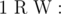
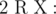
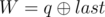
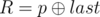
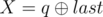

# D. Tree

**time limit per test:** 2 seconds

**memory limit per test:** 512 megabytes

**input:** standard input

**output:** standard output

You are given a node of the tree with index 1 and with weight 0. Let *cnt* be the number of nodes in the tree at any instant (initially, *cnt* is set to 1). Support *Q* queries of following two types:

-



 Add a new node (index *cnt* + 1) with weight *W* and add edge between node *R* and this node.
-



 Output the maximum length of sequence of nodes which
 - starts with *R*.
 - Every node in the sequence is an ancestor of its predecessor.
 - Sum of weight of nodes in sequence does not exceed *X*.
 - For some nodes *i*, *j* that are consecutive in the sequence if *i* is an ancestor of *j* then *w*[*i*] ≥ *w*[*j*] and there should not exist a node *k* on simple path from *i* to *j* such that *w*[*k*] ≥ *w*[*j*]


The tree is rooted at node 1 at any instant.

Note that the queries are given in a modified way.

#### Input

First line containing the number of queries *Q* (1 ≤ *Q* ≤ 400000).

Let *last* be the answer for previous query of type 2 (initially *last* equals 0).

Each of the next *Q* lines contains a query of following form:

- 1 p q (1 ≤ *p*, *q* ≤ 10^18^): This is query of first type where


 and



. It is guaranteed that 1 ≤ *R* ≤ *cnt* and 0 ≤ *W* ≤ 10^9^.
- 2 p q (1 ≤ *p*, *q* ≤ 10^18^): This is query of second type where



 and



. It is guaranteed that 1 ≤ *R* ≤ *cnt* and 0 ≤ *X* ≤ 10^15^.


 denotes bitwise XOR of *a* and *b*.

It is guaranteed that at least one query of type 2 exists.

#### Output

Output the answer to each query of second type in separate line.

#### Examples

#### Input
```
6
1 1 1
2 2 0
2 2 1
1 3 0
2 2 0
2 2 2
```

#### Output
```
0
1
1
2
```

#### Input
```
6
1 1 0
2 2 0
2 0 3
1 0 2
2 1 3
2 1 6
```

#### Output
```
2
2
3
2
```

#### Input
```
7
1 1 2
1 2 3
2 3 3
1 0 0
1 5 1
2 5 0
2 4 0
```

#### Output
```
1
1
2
```

#### Input
```
7
1 1 3
1 2 3
2 3 4
1 2 0
1 5 3
2 5 5
2 7 22
```

#### Output
```
1
2
3
```

#### Note

In the first example,

 *last* = 0

- Query 1: 1 1 1, Node 2 with weight 1 is added to node 1.

- Query 2: 2 2 0, No sequence of nodes starting at 2 has weight less than or equal to 0. *last* = 0

- Query 3: 2 2 1, Answer is 1 as sequence will be {2}. *last* = 1

- Query 4: 1 2 1, Node 3 with weight 1 is added to node 2.

- Query 5: 2 3 1, Answer is 1 as sequence will be {3}. Node 2 cannot be added as sum of weights cannot be greater than 1. *last* = 1

- Query 6: 2 3 3, Answer is 2 as sequence will be {3, 2}. *last* = 2
