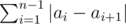
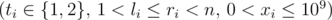

# F. Fafa and Array

**time limit per test:** 3 seconds

**memory limit per test:** 256 megabytes

**input:** standard input

**output:** standard output

Fafa has an array *A* of *n* positive integers, the function *f*(*A*) is defined as



. He wants to do *q* queries of two types:

- 1 *l* *r* *x* — find the maximum possible value of *f*(*A*), if *x* is to be added to one element in the range [*l*,  *r*]. You can choose to which element to add *x*.
- 2 *l* *r* *x* — increase all the elements in the range [*l*,  *r*] by value *x*.

Note that queries of type 1 don't affect the array elements.

#### Input

The first line contains one integer *n* (3 ≤ *n* ≤ 10^5^) — the length of the array.

The second line contains *n* positive integers *a*~1~, *a*~2~, ..., *a*~*n*~ (0 < *a*~*i*~ ≤ 10^9^) — the array elements.

The third line contains an integer *q* (1 ≤ *q* ≤ 10^5^) — the number of queries.

Then *q* lines follow, line *i* describes the *i*-th query and contains four integers *t*~*i*~ *l*~*i*~ *r*~*i*~ *x*~*i*~



.

It is guaranteed that at least one of the queries is of type 1.

#### Output

For each query of type 1, print the answer to the query.

#### Examples

#### Input
```
5
1 1 1 1 1
5
1 2 4 1
2 2 3 1
2 4 4 2
2 3 4 1
1 3 3 2
```

#### Output
```
2
8
```

#### Input
```
5
1 2 3 4 5
4
1 2 4 2
2 2 4 1
2 3 4 1
1 2 4 2
```

#### Output
```
6
10
```
