# E. Iqea

**time limit per test:** 3 seconds

**memory limit per test:** 256 megabytes

**input:** standard input

**output:** standard output

Gridland is placed on infinite grid and has a shape of figure consisting of cells. Every cell of Gridland is a city. Two cities that are placed in adjacent cells are connected by the road of length $1$. It's possible to get from any city to any other city using roads. The distance between two cities is the minimum total road length on path from one city to another. It's possible to get from any cell that doesn't belong to Gridland to any other cell that doesn't belong to Gridland by using only cells which don't belong to Gridland. In other words, Gridland is connected and complement of Gridland is also connected.

At the moment no city in Gridland has Iqea famous shop. But Iqea has great plans for building shops in Gridland. For customers' convenience Iqea decided to develop an application. Using this application everyone can learn the distance to the nearest Iqea. You are to develop this application.

You are asked to process two types of queries:

- new Iqea shop has been opened in the city with coordinates $(x, y)$;
- customer wants to know the distance to the nearest already opened Iqea shop from his city located in a cell with coordinates $(x, y)$.

Pay attention that customer can move only by roads and can never leave Gridland on his way to the shop.

#### Input

The first line contains one integer $n$ — number of cities in Gridland ($1 \le n \le 300\,000$). The following $n$ lines contain two integers $x_i$ and $y_i$ — coordinates of cell that contains $i$-th city ($1 \le x_i, y_i \le 300\,000$). No two cells coincide. Cells form connected area, complement of this area is also connected.

The following line contains single integer $q$ — number of queries ($0 \le q \le 300\,000$). Following $q$ lines contain queries, $i$-th line consists of three integers $t_i$, $x_i$ and $y_i$ ($t_i \in \{1, 2\}$, $1 \le x_i, y_i \le 300\,000$). If $t_i = 1$, new Iqea shop has been opened in the city with coordinates $(x_i, y_i)$. It's guaranteed that there was no Iqea shop in this city before. If $t_i = 2$, you are to find the distance to the nearest already opened Iqea shop from the city with coordinates $(x_i, y_i)$. It's guaranteed that in queries of both types cell $(x_i, y_i)$ belongs to Gridland.

#### Output

For every query of second type output single integer — minimum distance to the nearest Iqea shop. If no Iqea shop has been already opened, output $-1$.

#### Examples

#### Input
```
7
1 2
1 3
2 3
3 1
3 2
3 3
4 2
5
2 3 2
1 4 2
2 1 2
1 3 3
2 2 3
```

#### Output
```
-1
5
1
```

#### Input
```
6
1 1
1 2
1 3
2 1
2 2
3 1
4
1 3 1
2 1 2
1 2 2
2 1 3
```

#### Output
```
3
2
```

Explanation of the first example:

Before all queries

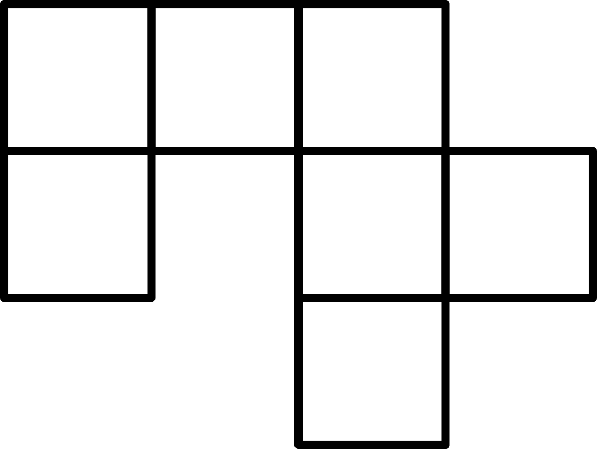

First query

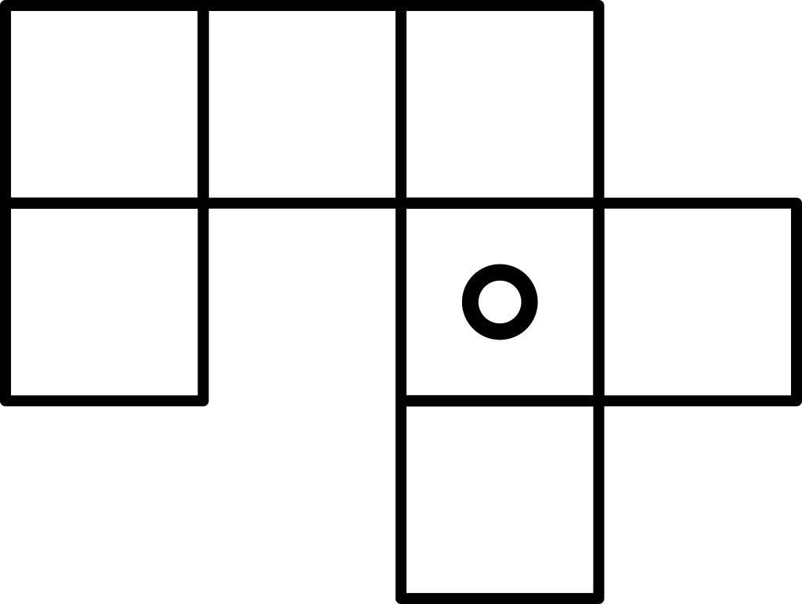

Second query

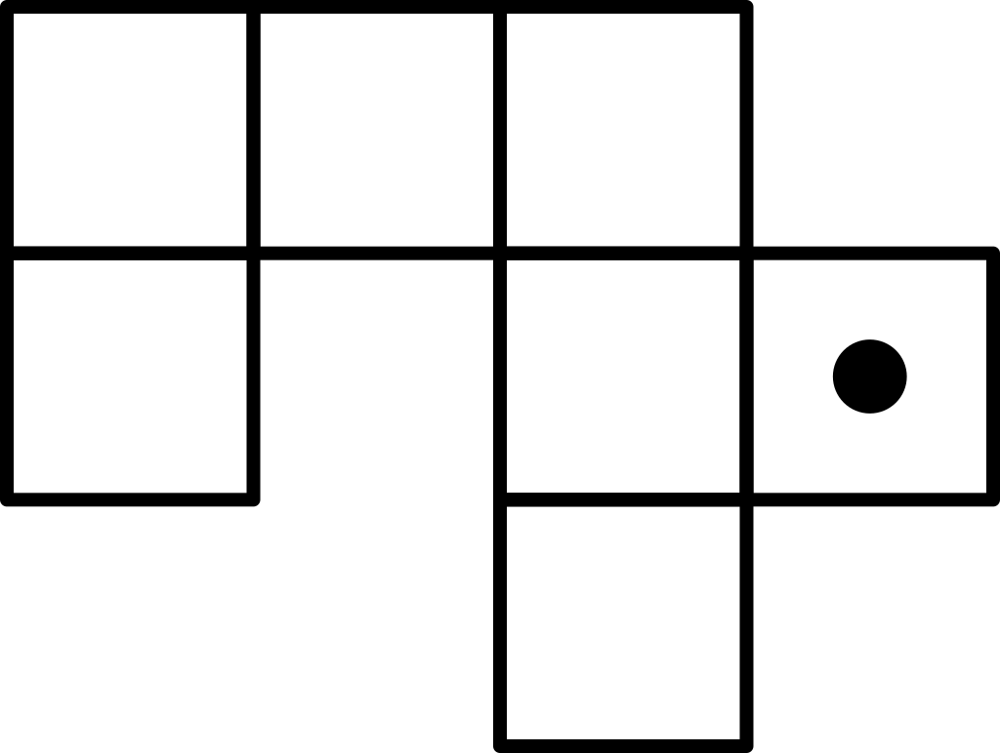

Third query

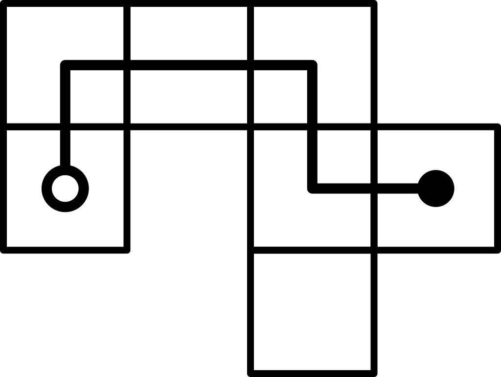

Fourth query

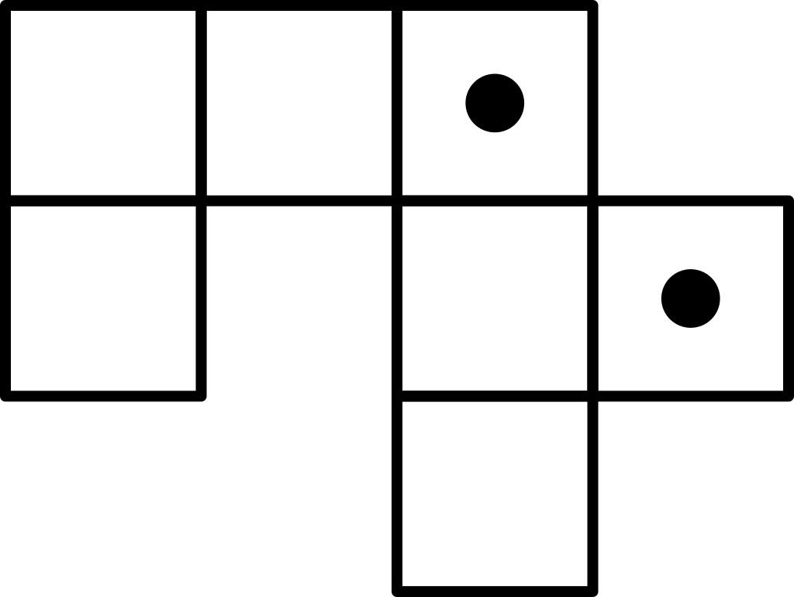

Fifth query

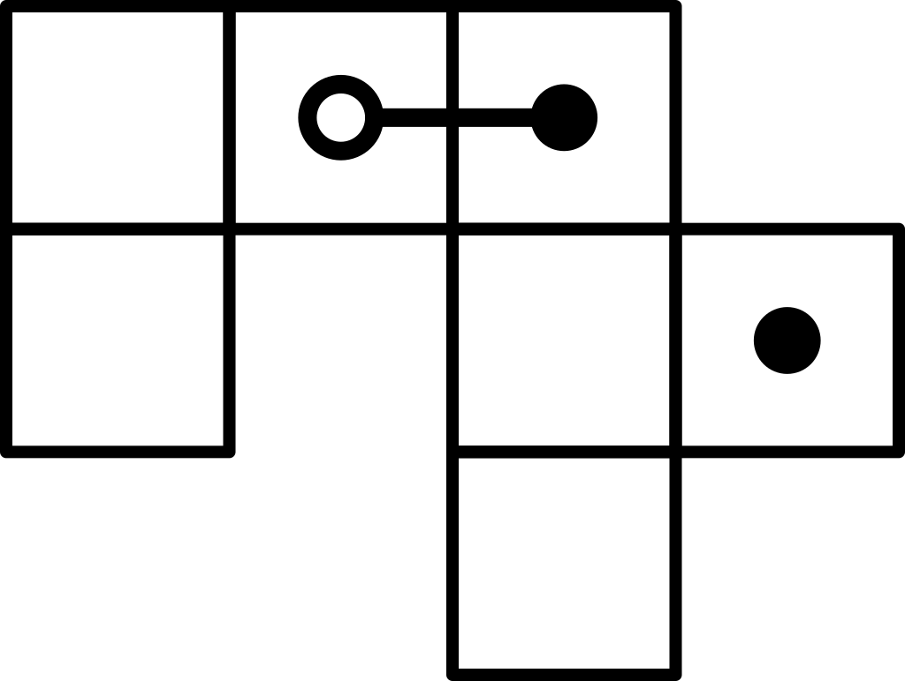

Explanation of the second example:

Before all queries

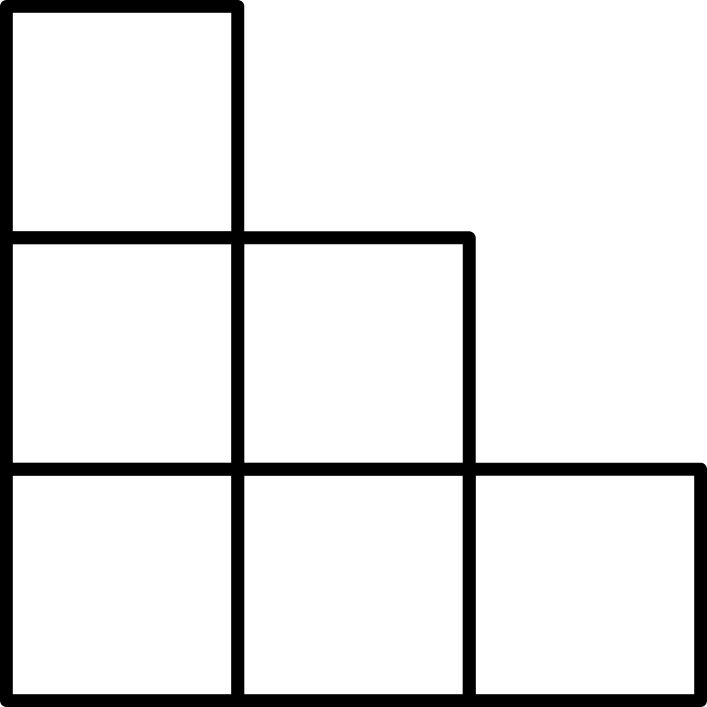

First query

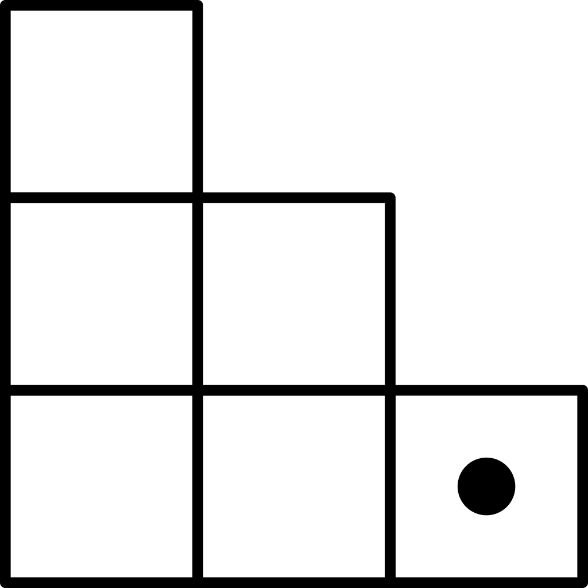

Second query

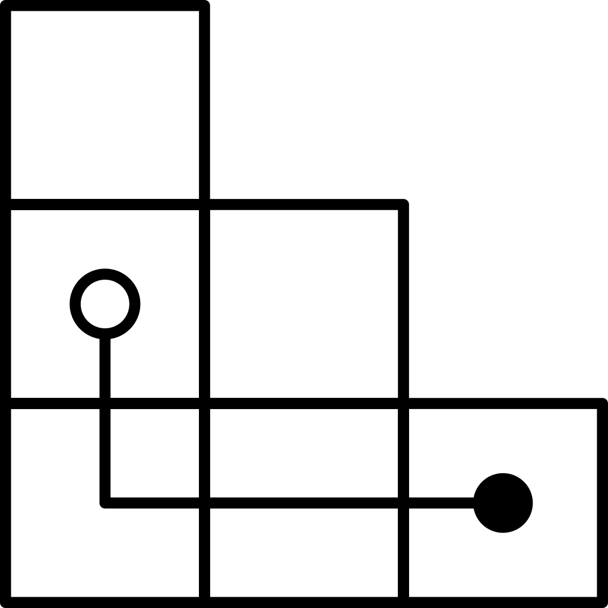

Third query

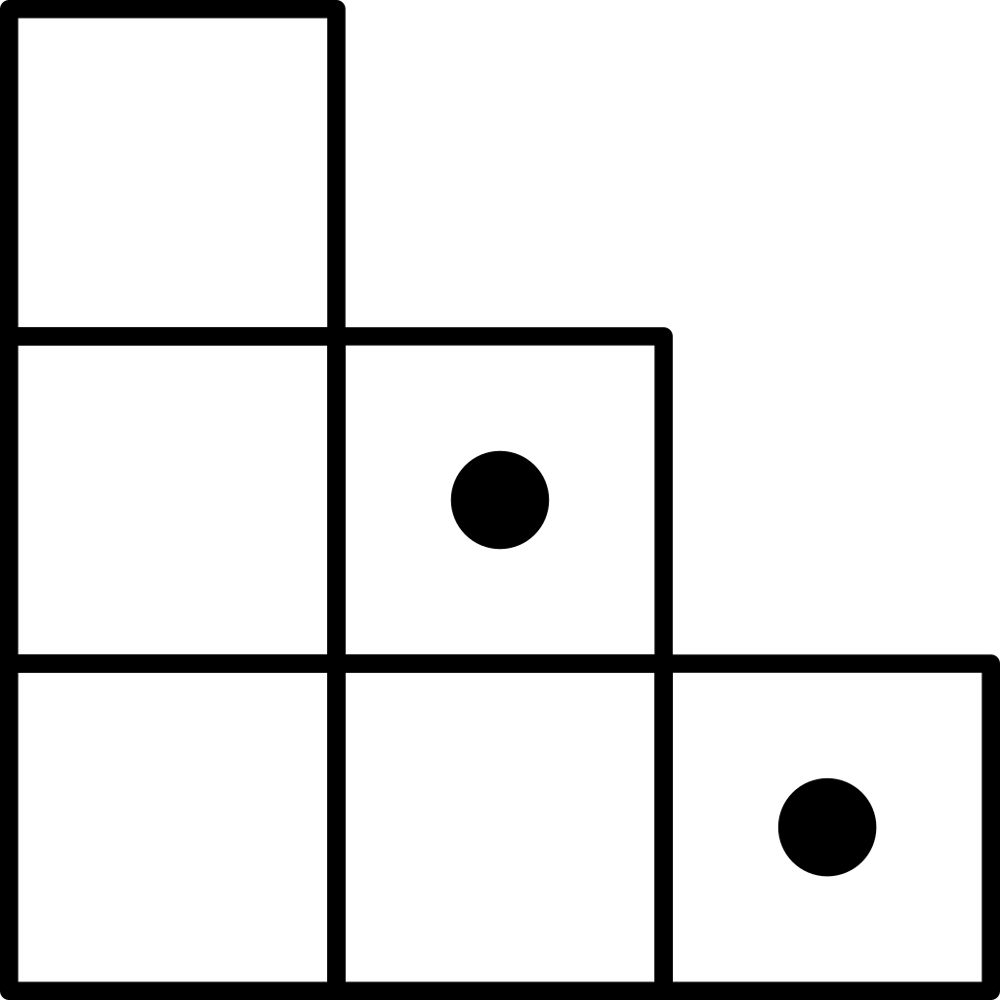

Fourth query

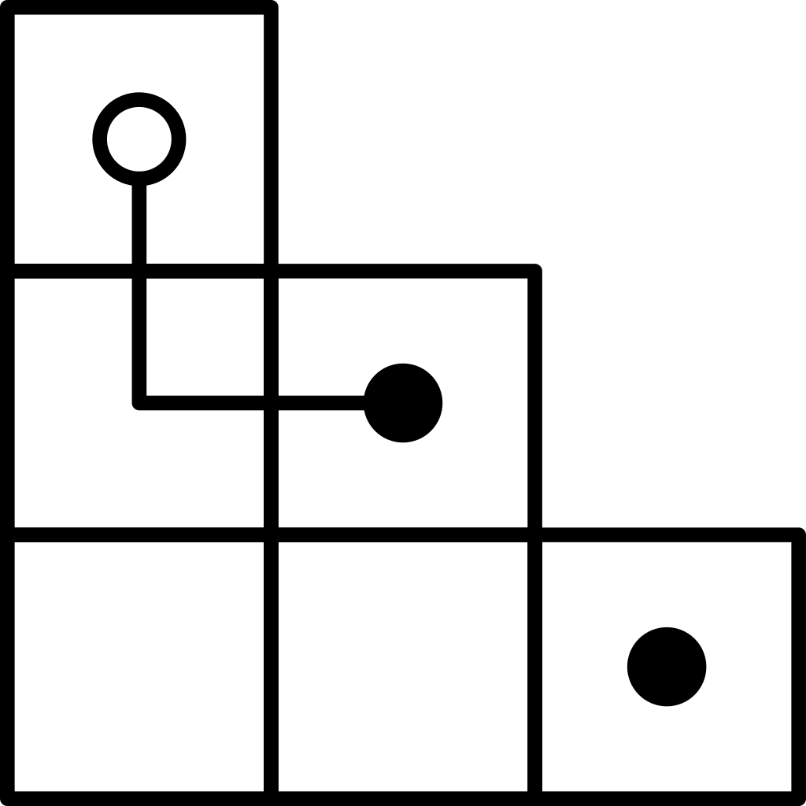
