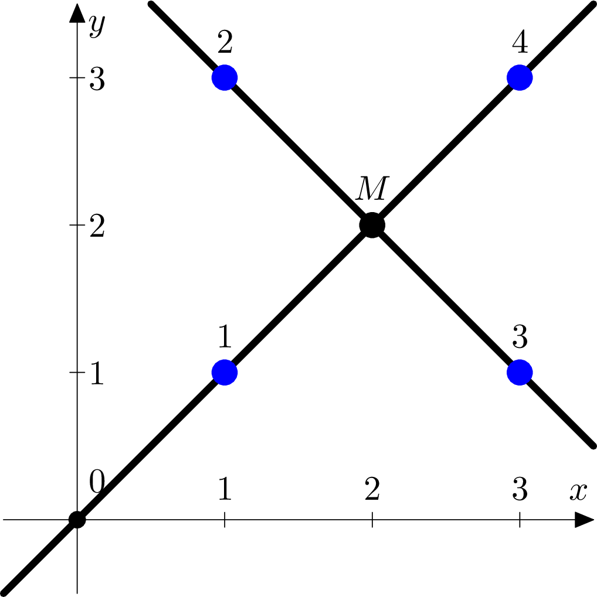
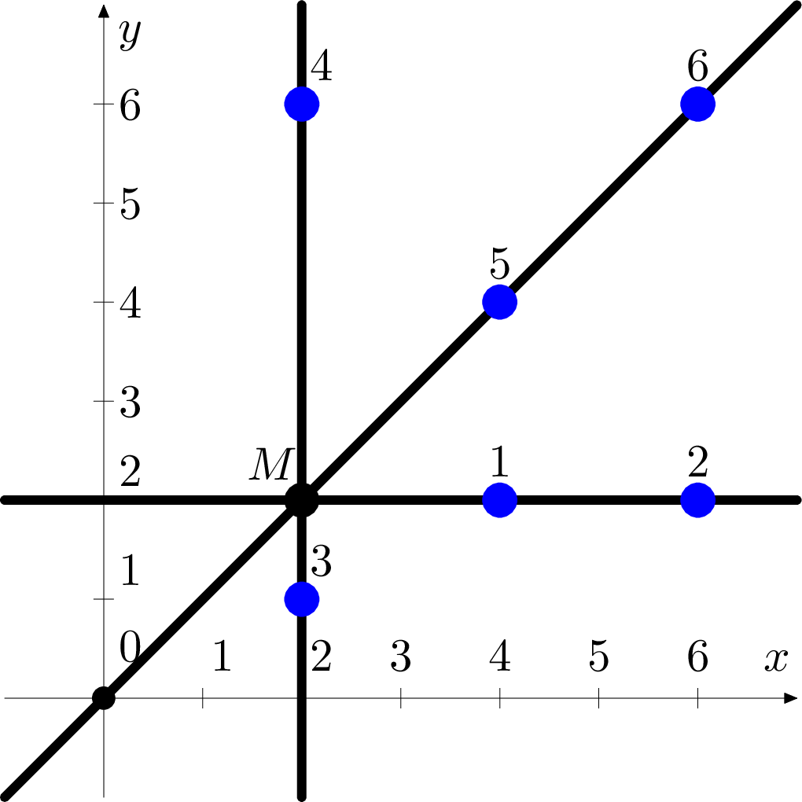
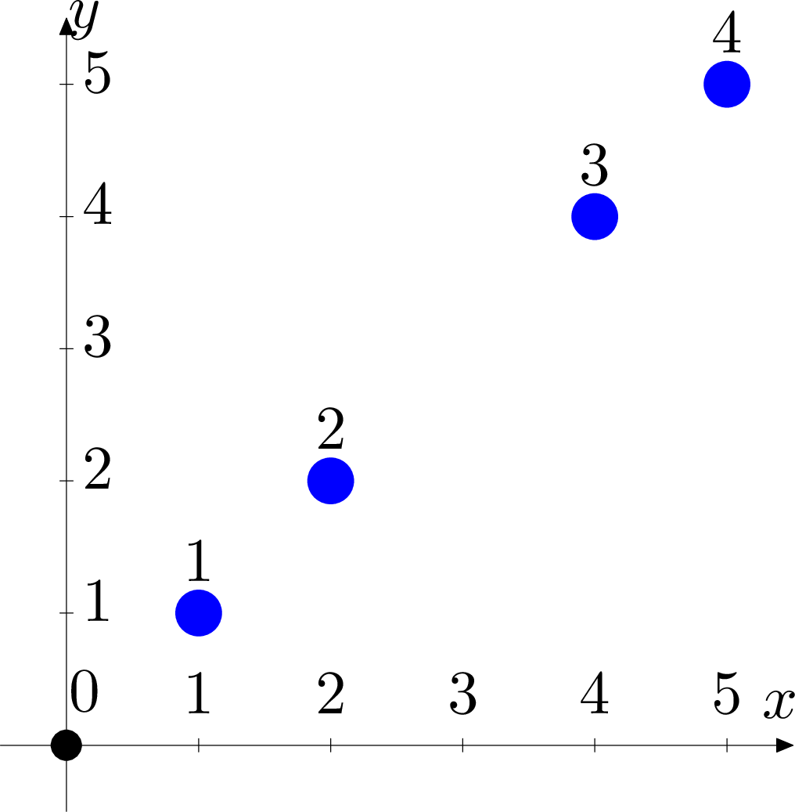
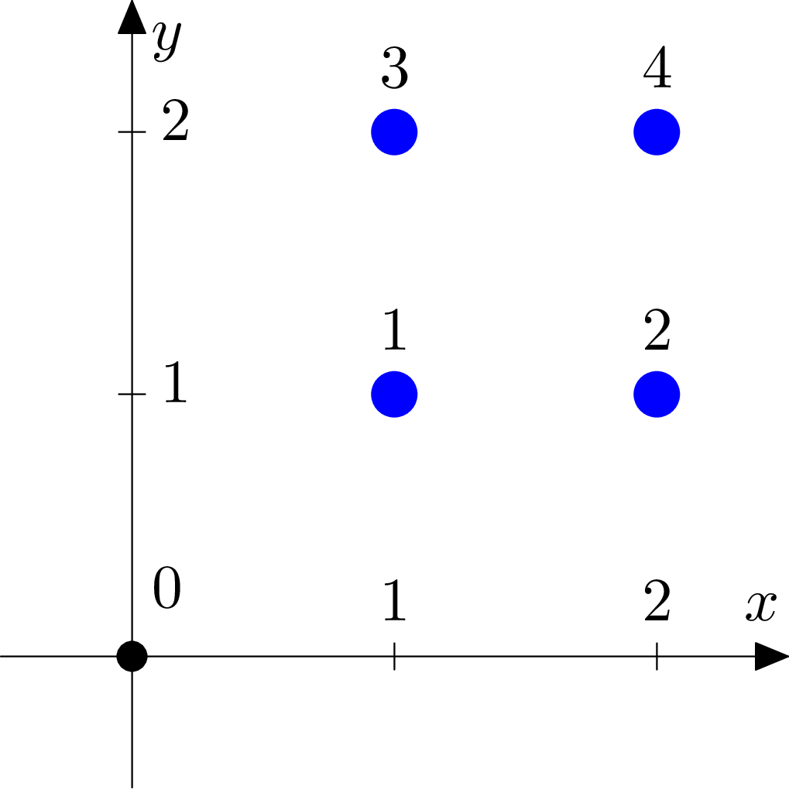
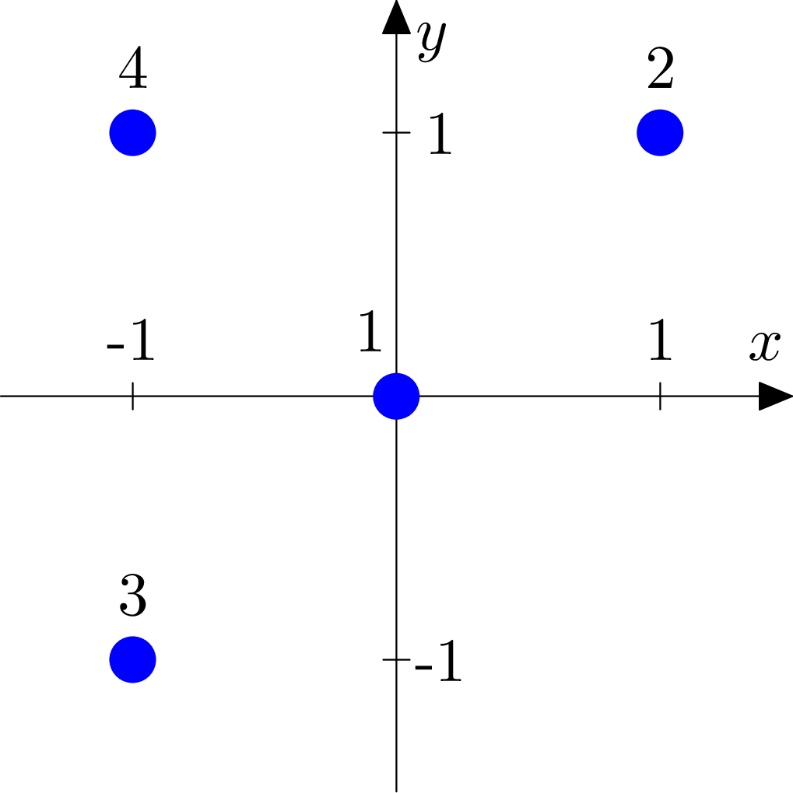

# F. Astronomy

**time limit per test:** 5 seconds

**memory limit per test:** 512 megabytes

**input:** standard input

**output:** standard output

Year 18 AD. Famous astronomer Philon the Berlander publishes a book "About Sky and Cosmos», in which he describes an incredible picture seen by him on a night sky while observing the skies. He once seen 2*n* stars on a clear sky and the Moon. Surprisingly, it was possible to divide all stars in pairs in such way that any line passing through the centers of two paired stars also passed through the center of the Moon, also all such lines were distinct. Philon carefully represented such a situation on a sky map, introducing a coordinate system. While doing that, he noticed that centers of all stars and the center of the Moon are points with integer coordinates. As Philon thought that the Earth and the Moon were flat, his coordinate system was two-dimensional. Coordinate system was chosen by an astronomer in such way that the coordinates of all objects (including the Moon) are no more than 10^6^ by the absolute value. Moreover, no two objects (two stars or a star and a Moon) were not located at the same point.

Apart from the sky map Philon wrote a prediction that in 2000 years stars will take exactly the same places, but the Moon will be replaced by a huge comet which will destroy the Earth.

It is 2018 AD now. You got a book of Philon the Berlander and you were horrified to discover that the stars on the sky are in exactly the same position as they were 2000 years ago! Unfortunately, some parts of a sky map were lost, so there are only star locations that are visible on it and there are no details about how the stars were divided in pairs. Moreover,, there is no point corresponding to the center of the Moon on this map. In order to find out the possible location of a comet and save the humanity from the terrible end, you should immediately find out some suitable location for the center of the Moon!

#### Input

In the first line of input there is an integer *n* (2 ≤ *n* ≤ 2600), the number of star pairs seen by an astronomer in the sky.

In the following 2*n* lines there are pairs of integers *x*~*i*~, *y*~*i*~ ( - 10^6^ ≤ *x*~*i*~, *y*~*i*~ ≤ 10^6^), the coordinates of star centers in the sky map. Note that the stars are listed in an arbitrary order that has nothing common with the distribution of stars into pairs as found out by Philon the Berlander. Centers of no two stars coincide.

#### Output

If astronomer was wrong and there is no way to distribute all points in pairs in such manner that all lines passing through these point pairs are distinct lines intersecting in a single point with integer coordinates, and this intersection point is different from centers of all stars, then print "No" (without the quotes) in the only line of input.

Otherwise print "Yes" (without the quotes). In the second line print pair of integers *x*, *y* (|*x*|, |*y*| ≤ 10^6^), the coordinates of a point that contains a center of the Moon in your solution. If there are several possible answers, output any of them. Note that the printed point should be different from all the star centers.

#### Examples

#### Input
```
2
1 1
1 3
3 1
3 3
```

#### Output
```
Yes
2 2
```

#### Input
```
3
4 2
6 2
2 1
2 6
4 4
6 6
```

#### Output
```
Yes
2 2
```

#### Input
```
2
1 1
2 2
4 4
5 5
```

#### Output
```
No
```

#### Input
```
2
1 1
2 1
1 2
2 2
```

#### Output
```
No
```

#### Input
```
2
0 0
1 1
-1 -1
-1 1
```

#### Output
```
No
```

#### Note

Pictures for the sample tests are given below.











In the fourth sample test the Moon center could not have possibly been in a point (1.5, 1.5) since the coordinates of this point are non-integer.

In the fifth sample test there are no suitable points that do not coincide with a center of some star.
