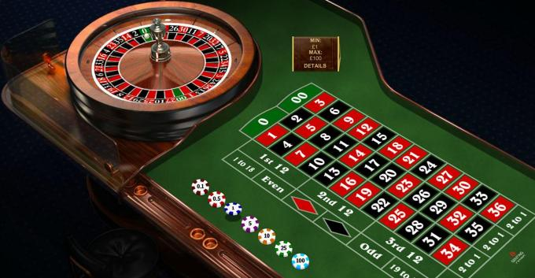

# D. I'm Feeling Lucky!

**time limit per test:** 1 second

**memory limit per test:** 256 megabytes

**input:** standard input

**output:** standard output

You have one chip and one chance to play roulette. Are you feeling lucky?

#### Output

Print your bet. Your chip must be placed entirely within some square (not on an edge or a corner shared by adjacent squares).
