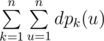
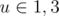

# F. Heaps

**time limit per test:** 2.5 seconds

**memory limit per test:** 512 megabytes

**input:** standard input

**output:** standard output

You're given a tree with *n* vertices rooted at 1.

We say that there's a *k*-ary heap of depth *m* located at *u* if the following holds:

- For *m* = 1 *u* itself is a *k*-ary heap of depth 1.
- For *m* > 1 vertex *u* is a *k*-ary heap of depth *m* if at least *k* of its children are *k*-ary heaps of depth at least *m* - 1.

Denote *dp*~*k*~(*u*) as maximum depth of *k*-ary heap in the subtree of *u* (including *u*). Your goal is to compute



.

#### Input

The first line contains an integer *n* denoting the size of the tree (2 ≤ *n* ≤ 3·10^5^).

The next *n* - 1 lines contain two integers *u*, *v* each, describing vertices connected by *i*-th edge.

It's guaranteed that the given configuration forms a tree.

#### Output

Output the answer to the task.

#### Examples

#### Input
```
4
1 3
2 3
4 3
```

#### Output
```
21
```

#### Input
```
4
1 2
2 3
3 4
```

#### Output
```
22
```

#### Note

Consider sample case one.

For *k* ≥ 3 all *dp*~*k*~ will be equal to 1.

For *k* = 2 *dp*~*k*~ is 2 if



 and 1 otherwise.

For *k* = 1 *dp*~*k*~ values are (3, 1, 2, 1) respectively.

To sum up, 4·1 + 4·1 + 2·2 + 2·1 + 3 + 1 + 2 + 1 = 21.
