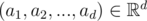
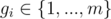
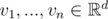
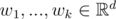
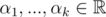

# D2. Hyperspace Jump (hard)

**time limit per test:** 3 seconds

**memory limit per test:** 256 megabytes

**input:** standard input

**output:** standard output

It is now 125 years later, but humanity is still on the run from a humanoid-cyborg race determined to destroy it. Or perhaps we are getting some stories mixed up here... In any case, the fleet is now smaller. However, in a recent upgrade, all the navigation systems have been outfitted with higher-dimensional, linear-algebraic jump processors.

Now, in order to make a jump, a ship's captain needs to specify a subspace of the *d*-dimensional space in which the events are taking place. She does so by providing a generating set of vectors for that subspace.

Princess Heidi has received such a set from the captain of each of *m* ships. Again, she would like to group up those ships whose hyperspace jump subspaces are equal. To do so, she wants to assign a group number between 1 and *m* to each of the ships, so that two ships have the same group number if and only if their corresponding subspaces are equal (even though they might be given using different sets of vectors).

Help Heidi!

#### Input

The first line of the input contains two space-separated integers *m* and *d* (2 ≤ *m* ≤ 30 000, 1 ≤ *d* ≤ 5) – the number of ships and the dimension of the full underlying vector space, respectively. Next, the *m* subspaces are described, one after another. The *i*-th subspace, which corresponds to the *i*-th ship, is described as follows:

The first line contains one integer *k*~*i*~ (1 ≤ *k*~*i*~ ≤ *d*). Then *k*~*i*~ lines follow, the *j*-th of them describing the *j*-th vector sent by the *i*-th ship. Each of the *j* lines consists of *d* space-separated integers *a*~*j*~, *j* = 1, ..., *d*, that describe the vector



; it holds that |*a*~*j*~| ≤ 250. The *i*-th subspace is the linear span of these *k*~*i*~ vectors.

#### Output

Output *m* space-separated integers *g*~1~, ..., *g*~*m*~, where



 denotes the group number assigned to the *i*-th ship. That is, for any 1 ≤ *i* < *j* ≤ *m*, the following should hold: *g*~*i*~ = *g*~*j*~ if and only if the *i*-th and the *j*-th subspaces are equal. In addition, the sequence (*g*~1~, *g*~2~, ..., *g*~*m*~) should be lexicographically minimal among all sequences with that property.

#### Example

#### Input
```
8 2
1
5 0
1
0 1
1
0 1
2
0 6
0 1
2
0 1
1 0
2
-5 -5
4 3
2
1 1
0 1
2
1 0
1 0
```

#### Output
```
1 2 2 2 3 3 3 1 
```

#### Note

In the sample testcase, the first and the last subspace are equal, subspaces 2 to 4 are equal, and subspaces 5 to 7 are equal.

Recall that two subspaces, one given as the span of vectors



 and another given as the span of vectors



, are equal if each vector *v*~*i*~ can be written as a linear combination of vectors *w*~1~, ..., *w*~*k*~ (that is, there exist coefficients



 such that *v*~*i*~ = α~1~*w*~1~ + ... + α~*k*~*w*~*k*~) and, similarly, each vector *w*~*i*~ can be written as a linear combination of vectors *v*~1~, ..., *v*~*n*~.

Recall that a sequence (*g*~1~, *g*~2~, ..., *g*~*m*~) is lexicographically smaller than a sequence (*h*~1~, *h*~2~, ..., *h*~*m*~) if there exists an index *i*, 1 ≤ *i* ≤ *m*, such that *g*~*i*~ < *h*~*i*~ and *g*~*j*~ = *h*~*j*~ for all *j* < *i*.
