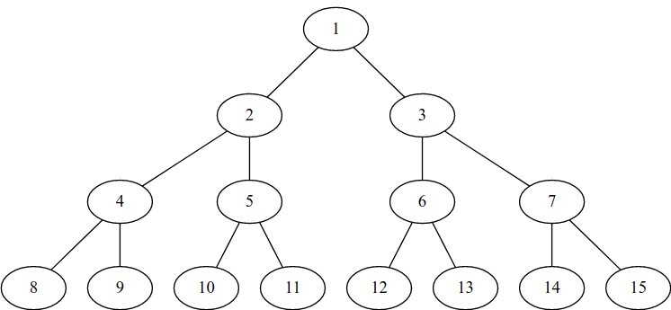
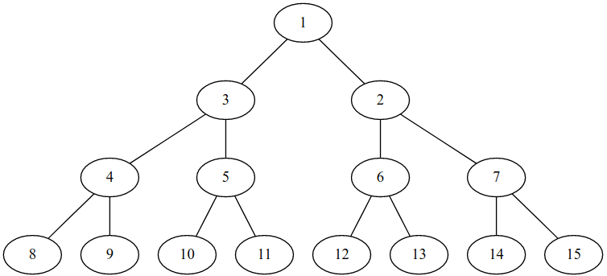
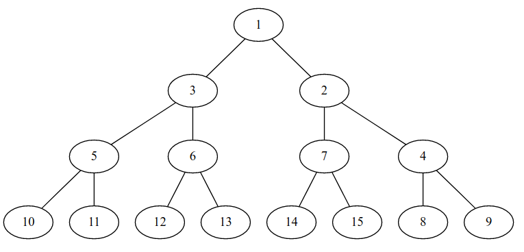

# D. Full Binary Tree Queries

**time limit per test:** 4 seconds

**memory limit per test:** 256 megabytes

**input:** standard input

**output:** standard output

You have a full binary tree having infinite levels.

Each node has an initial value. If a node has value *x*, then its left child has value 2·*x* and its right child has value 2·*x* + 1.

The value of the root is 1.

You need to answer *Q* queries.

There are 3 types of queries:
- Cyclically shift the values of all nodes on the same level as node with value *X* by *K* units. (The values/nodes of any other level are not affected).
- Cyclically shift the nodes on the same level as node with value *X* by *K* units. (The subtrees of these nodes will move along with them).
- Print the value of every node encountered on the simple path from the node with value *X* to the root.

Positive *K* implies right cyclic shift and negative *K* implies left cyclic shift.

It is guaranteed that atleast one type 3 query is present.

#### Input

The first line contains a single integer *Q* (1 ≤ *Q* ≤ 10^5^).

Then *Q* queries follow, one per line:

- Queries of type 1 and 2 have the following format: *T* *X* *K* (1 ≤ *T* ≤ 2; 1 ≤ *X* ≤ 10^18^; 0 ≤ |*K*| ≤ 10^18^), where *T* is type of the query.
- Queries of type 3 have the following format: 3 *X* (1 ≤ *X* ≤ 10^18^).

#### Output

For each query of type 3, print the values of all nodes encountered in descending order.

#### Examples

#### Input
```
5
3 12
1 2 1
3 12
2 4 -1
3 8
```

#### Output
```
12 6 3 1 
12 6 2 1 
8 4 2 1 
```

#### Input
```
5
3 14
1 5 -3
3 14
1 3 1
3 14
```

#### Output
```
14 7 3 1 
14 6 3 1 
14 6 2 1 
```

#### Note

Following are the images of the first 4 levels of the tree in the first test case:

Original:





 After query 1 2 1:





 After query 2 4 -1:



