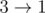
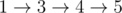

# F. Pathwalks

**time limit per test:** 1 second

**memory limit per test:** 256 megabytes

**input:** standard input

**output:** standard output

You are given a directed graph with *n* nodes and *m* edges, with all edges having a certain weight.

There might be multiple edges and self loops, and the graph can also be disconnected.

You need to choose a path (possibly passing through same vertices multiple times) in the graph such that the weights of the edges are in strictly increasing order, and these edges come in the order of input. Among all such paths, you need to find the the path that has the maximum possible number of edges, and report this value.

Please note that the edges picked don't have to be consecutive in the input.

#### Input

The first line contains two integers *n* and *m* (1 ≤ *n* ≤ 100000,1 ≤ *m* ≤ 100000) — the number of vertices and edges in the graph, respectively.

*m* lines follows.

The *i*-th of these lines contains three space separated integers *a*~*i*~, *b*~*i*~ and *w*~*i*~ (1 ≤ *a*~*i*~, *b*~*i*~ ≤ *n*, 0 ≤ *w*~*i*~ ≤ 100000), denoting an edge from vertex *a*~*i*~ to vertex *b*~*i*~ having weight *w*~*i*~

#### Output

Print one integer in a single line — the maximum number of edges in the path.

#### Examples

#### Input
```
3 3
3 1 3
1 2 1
2 3 2
```

#### Output
```
2
```

#### Input
```
5 5
1 3 2
3 2 3
3 4 5
5 4 0
4 5 8
```

#### Output
```
3
```

#### Note

The answer for the first sample input is 2:


. Note that you cannot traverse


 because edge



 appears earlier in the input than the other two edges and hence cannot be picked/traversed after either of the other two edges.

In the second sample, it's optimal to pick 1-st, 3-rd and 5-th edges to get the optimal answer:



.
