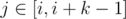

# B. Lecture Sleep

**time limit per test:** 1 second

**memory limit per test:** 256 megabytes

**input:** standard input

**output:** standard output

Your friend Mishka and you attend a calculus lecture. Lecture lasts *n* minutes. Lecturer tells *a*~*i*~ theorems during the *i*-th minute.

Mishka is really interested in calculus, though it is so hard to stay awake for all the time of lecture. You are given an array *t* of Mishka's behavior. If Mishka is asleep during the *i*-th minute of the lecture then *t*~*i*~ will be equal to 0, otherwise it will be equal to 1. When Mishka is awake he writes down all the theorems he is being told — *a*~*i*~ during the *i*-th minute. Otherwise he writes nothing.

You know some secret technique to keep Mishka awake for *k* minutes straight. However you can use it only once. You can start using it at the beginning of any minute between 1 and *n* - *k* + 1. If you use it on some minute *i* then Mishka will be awake during minutes *j* such that



 and will write down all the theorems lecturer tells.

You task is to calculate the maximum number of theorems Mishka will be able to write down if you use your technique only once to wake him up.

#### Input

The first line of the input contains two integer numbers *n* and *k* (1 ≤ *k* ≤ *n* ≤ 10^5^) — the duration of the lecture in minutes and the number of minutes you can keep Mishka awake.

The second line of the input contains *n* integer numbers *a*~1~, *a*~2~, ... *a*~*n*~ (1 ≤ *a*~*i*~ ≤ 10^4^) — the number of theorems lecturer tells during the *i*-th minute.

The third line of the input contains *n* integer numbers *t*~1~, *t*~2~, ... *t*~*n*~ (0 ≤ *t*~*i*~ ≤ 1) — type of Mishka's behavior at the *i*-th minute of the lecture.

#### Output

Print only one integer — the maximum number of theorems Mishka will be able to write down if you use your technique only once to wake him up.

#### Example

#### Input
```
6 3
1 3 5 2 5 4
1 1 0 1 0 0
```

#### Output
```
16
```

#### Note

In the sample case the better way is to use the secret technique at the beginning of the third minute. Then the number of theorems Mishka will be able to write down will be equal to 16.
