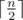
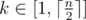

# F. k-substrings

**time limit per test:** 4 seconds

**memory limit per test:** 256 megabytes

**input:** standard input

**output:** standard output

You are given a string *s* consisting of *n* lowercase Latin letters.

Let's denote *k*-substring of *s* as a string *subs*~*k*~ = *s*~*k*~*s*~*k* + 1~..*s*~*n* + 1 - *k*~. Obviously, *subs*~1~ = *s*, and there are exactly



 such substrings.

Let's call some string *t* an odd proper suprefix of a string *T* iff the following conditions are met:

- |*T*| > |*t*|;
- |*t*| is an odd number;
- *t* is simultaneously a prefix and a suffix of *T*.

For evey *k*-substring (



) of *s* you have to calculate the maximum length of its odd proper suprefix.

#### Input

The first line contains one integer *n* (2 ≤ *n* ≤ 10^6^) — the length *s*.

The second line contains the string *s* consisting of *n* lowercase Latin letters.

#### Output

Print


 integers. *i*-th of them should be equal to maximum length of an odd proper suprefix of *i*-substring of *s* (or  - 1, if there is no such string that is an odd proper suprefix of *i*-substring).

#### Examples

#### Input
```
15
bcabcabcabcabca
```

#### Output
```
9 7 5 3 1 -1 -1 -1
```

#### Input
```
24
abaaabaaaabaaabaaaabaaab
```

#### Output
```
15 13 11 9 7 5 3 1 1 -1 -1 1
```

#### Input
```
19
cabcabbcabcabbcabca
```

#### Output
```
5 3 1 -1 -1 1 1 -1 -1 -1
```

#### Note

The answer for first sample test is folowing:

- 1-substring: bcabcabcabcabca
- 2-substring: cabcabcabcabc
- 3-substring: abcabcabcab
- 4-substring: bcabcabca
- 5-substring: cabcabc
- 6-substring: abcab
- 7-substring: bca
- 8-substring: c
