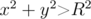
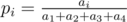
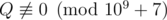
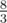
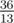

# E. Circles of Waiting

**time limit per test:** 2 seconds

**memory limit per test:** 256 megabytes

**input:** standard input

**output:** standard output

A chip was placed on a field with coordinate system onto point (0, 0).

Every second the chip moves randomly. If the chip is currently at a point (*x*, *y*), after a second it moves to the point (*x* - 1, *y*) with probability *p*~1~, to the point (*x*, *y* - 1) with probability *p*~2~, to the point (*x* + 1, *y*) with probability *p*~3~ and to the point (*x*, *y* + 1) with probability *p*~4~. It's guaranteed that *p*~1~ + *p*~2~ + *p*~3~ + *p*~4~ = 1. The moves are independent.

Find out the expected time after which chip will move away from origin at a distance greater than *R* (i.e.



 will be satisfied).

#### Input

First line contains five integers *R*, *a*~1~, *a*~2~, *a*~3~ and *a*~4~ (0 ≤ *R* ≤ 50, 1 ≤ *a*~1~, *a*~2~, *a*~3~, *a*~4~ ≤ 1000).

Probabilities *p*~*i*~ can be calculated using formula



.

#### Output

It can be shown that answer for this problem is always a rational number of form


, where



.

Print *P*·*Q*^ - 1^ modulo 10^9^ + 7.

#### Examples

#### Input
```
0 1 1 1 1
```

#### Output
```
1
```

#### Input
```
1 1 1 1 1
```

#### Output
```
666666674
```

#### Input
```
1 1 2 1 2
```

#### Output
```
538461545
```

#### Note

In the first example initially the chip is located at a distance 0 from origin. In one second chip will move to distance 1 is some direction, so distance to origin will become 1.

Answers to the second and the third tests:



 and



.
