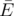
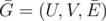
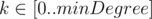

# F. Minimal k-covering

**time limit per test:** 1.5 seconds

**memory limit per test:** 256 megabytes

**input:** standard input

**output:** standard output

You are given a bipartite graph *G* = (*U*, *V*, *E*), *U* is the set of vertices of the first part, *V* is the set of vertices of the second part and *E* is the set of edges. There might be multiple edges.

Let's call some subset of its edges



 *k*-covering iff the graph



 has each of its vertices incident to at least *k* edges. Minimal *k*-covering is such a *k*-covering that the size of the subset


 is minimal possible.

Your task is to find minimal *k*-covering for each



, where *minDegree* is the minimal degree of any vertex in graph *G*.

#### Input

The first line contains three integers *n*~1~, *n*~2~ and *m* (1 ≤ *n*~1~, *n*~2~ ≤ 2000, 0 ≤ *m* ≤ 2000) — the number of vertices in the first part, the number of vertices in the second part and the number of edges, respectively.

The *i*-th of the next *m* lines contain two integers *u*~*i*~ and *v*~*i*~ (1 ≤ *u*~*i*~ ≤ *n*~1~, 1 ≤ *v*~*i*~ ≤ *n*~2~) — the description of the *i*-th edge, *u*~*i*~ is the index of the vertex in the first part and *v*~*i*~ is the index of the vertex in the second part.

#### Output

For each


 print the subset of edges (minimal *k*-covering) in separate line.

The first integer *cnt*~*k*~ of the *k*-th line is the number of edges in minimal *k*-covering of the graph. Then *cnt*~*k*~ integers follow — original indices of the edges which belong to the minimal *k*-covering, these indices should be pairwise distinct. Edges are numbered 1 through *m* in order they are given in the input.

#### Examples

#### Input
```
3 3 7
1 2
2 3
1 3
3 2
3 3
2 1
2 1
```

#### Output
```
0 
3 3 7 4 
6 1 3 6 7 4 5 
```

#### Input
```
1 1 5
1 1
1 1
1 1
1 1
1 1
```

#### Output
```
0 
1 5 
2 4 5 
3 3 4 5 
4 2 3 4 5 
5 1 2 3 4 5 
```
