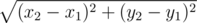

# B. Running Student

**time limit per test:** 1 second

**memory limit per test:** 64 megabytes

**input:** stdin

**output:** stdout

And again a misfortune fell on Poor Student. He is being late for an exam.

Having rushed to a bus stop that is in point (0, 0), he got on a minibus and they drove along a straight line, parallel to axis *OX*, in the direction of increasing *x*.

Poor Student knows the following:

- during one run the minibus makes *n* stops, the *i*-th stop is in point (*x*~*i*~, 0)
- coordinates of all the stops are different
- the minibus drives at a constant speed, equal to *v*~*b*~
- it can be assumed the passengers get on and off the minibus at a bus stop momentarily
- Student can get off the minibus only at a bus stop
- Student will have to get off the minibus at a terminal stop, if he does not get off earlier
- the University, where the exam will be held, is in point (*x*~*u*~, *y*~*u*~)
- Student can run from a bus stop to the University at a constant speed *v*~*s*~ as long as needed
- a distance between two points can be calculated according to the following formula:




- Student is already on the minibus, so, he cannot get off at the first bus stop

Poor Student wants to get to the University as soon as possible. Help him to choose the bus stop, where he should get off. If such bus stops are multiple, choose the bus stop closest to the University.

#### Input

The first line contains three integer numbers: 2 ≤ *n* ≤ 100, 1 ≤ *v*~*b*~, *v*~*s*~ ≤ 1000. The second line contains *n* non-negative integers in ascending order: coordinates *x*~*i*~ of the bus stop with index *i*. It is guaranteed that *x*~1~ equals to zero, and *x*~*n*~ ≤ 10^5^. The third line contains the coordinates of the University, integers *x*~*u*~ and *y*~*u*~, not exceeding 10^5^ in absolute value.

#### Output

In the only line output the answer to the problem — index of the optimum bus stop.

#### Examples

#### Input
```
4 5 2
0 2 4 6
4 1
```

#### Output
```
3
```

#### Input
```
2 1 1
0 100000
100000 100000
```

#### Output
```
2
```

#### Note

As you know, students are a special sort of people, and minibuses usually do not hurry. That's why you should not be surprised, if Student's speed is higher than the speed of the minibus.
